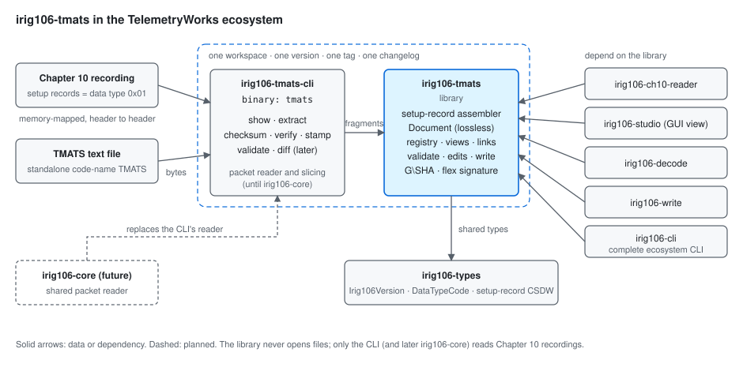
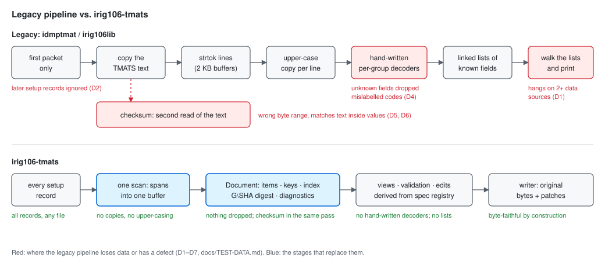
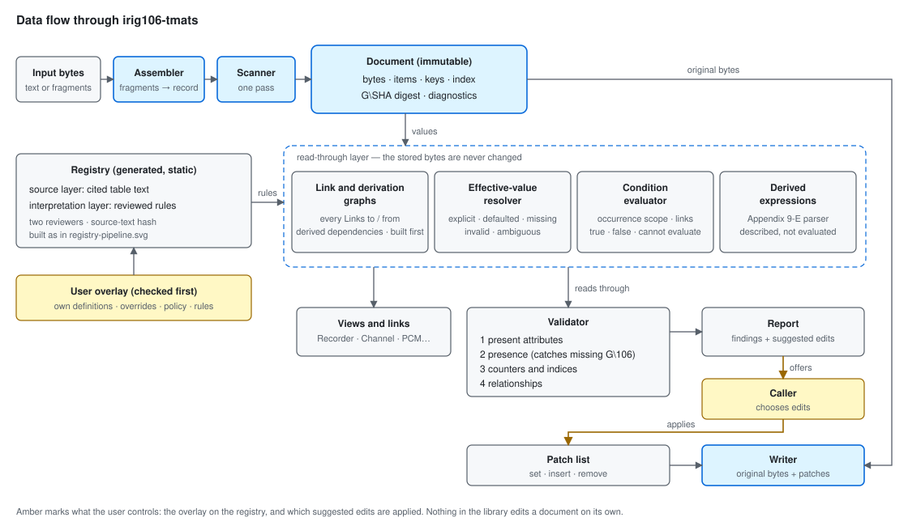
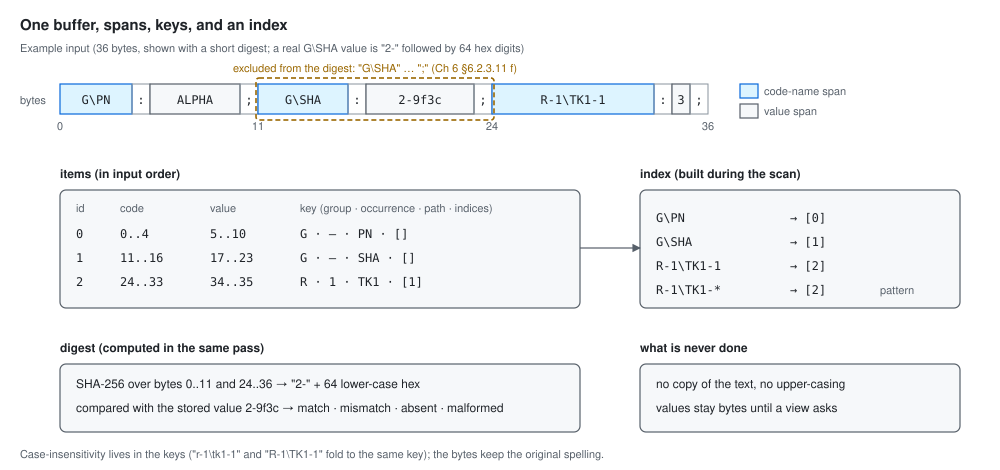
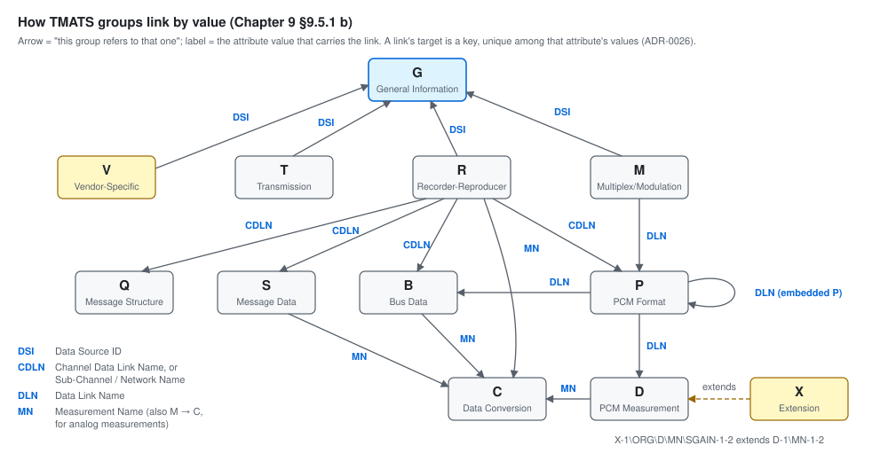
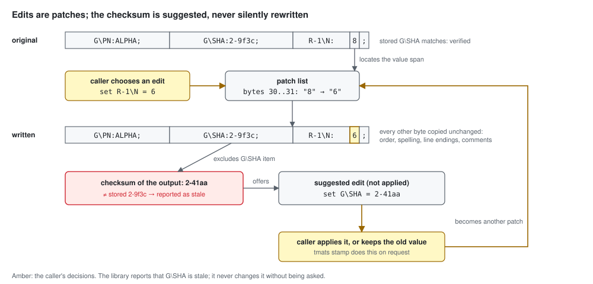

# irig106-tmats — Architecture

> **Status: draft for review (design phase).** This document replaces the
> prototype's architecture notes (preserved at the git tag `prototype-0`).
> Section 2 records the architecture proposal **word for word** as it was
> made in the design discussion on 2026-09-25; later sections will refine it
> into modules, data flow, and interfaces, and each numbered point becomes an
> ADR in `docs/adr/`. Use cases are in `docs/USE-CASES.md`.

## 1. Direction from the project owner

> "I dont necessarily want to follow the legacy tools Pipeline sketch. Lets
> make our architecture better, faster, less error prone. What can we do
> better here?"

The "legacy tools pipeline sketch" is the one proposed in the owner's
ChatGPT conversation (recorded verbatim, with verification notes, in
`docs/research/2026-09-25-irig106org-tools.md`):

```text
Chapter 10 packet
      │
      ▼
TMATS packet 0x01
      │
      ▼
raw TMATS text
      │
      ▼
TMATS lexer/parser
      │
      ├── G records
      ├── R records
      ├── M records
      ├── P records
      ├── B records
      ├── C records
      ├── D records
      └── ...
      │
      ▼
structured TMATS model
      │
      ├── raw view
      ├── tree view
      ├── channel mapping
      └── semantic lookup
```

Its overall flow (packet → text → parse → model → views) is sound; its "one
record type per group" model is the design that failed in the prototype, and
is not adopted.

## 2. The proposal (verbatim, 2026-09-25)

### A better architecture than the legacy pipeline

Here's what `idmptmat` and `irig106lib` actually do, from their source:
1. Copy the packet's text.
2. Split it into lines with `strtok`, into fixed 2 KB buffers.
3. Make an upper-cased copy of every line.
4. Match each code name against hand-written, per-group decoder files (`i106_decode_tmats_r.c` and so on) into linked lists of C structs that hold only the fields someone thought to decode.
5. Walk those lists to print.

Every stage loses information or invites bugs. Unknown fields are dropped, the linked-list walk hangs (D1), the signature re-reads the text on its own path with its own bugs (D5, D6), only the first packet is read (D2), and the first error aborts.

Here's what I'd do instead, organised around one principle: **read the bytes once, never copy them, and let the spec's own tables drive everything else.**

```text
bytes ──► 1 scan ──► Document (immutable, one owned buffer)
                      ├─ items: [ {code span, value span, parsed key} ]   flat, in order
                      ├─ keys:  interned, case-folded structured code names
                      ├─ index: key → item ids   (built during the scan)
                      ├─ digest: G\SHA SHA-256   (computed during the same scan)
                      └─ diagnostics: [ {span, kind} ]   (never aborts)
                                │
     spec-cited registry ───────┼──► link graph (from the spec's "Links to/from")
     (static tables +           │
      user overlay)             ├──► typed views: Recorder, Channel, PcmFormat…
                                │     (borrow the document, parse values lazily)
                                ├──► validator (rules = registry data + policy)
                                └──► edits = patch list over the original bytes
                                      └──► writer: original bytes + patches
```

**Faster**
1. **One pass, no copies.** A byte scanner (`memchr` for `:` and `;`, vectorised) records spans into one owned buffer. There are no per-line allocations and no upper-cased copy of the file. Case-insensitivity is handled once, when each code name is folded into a compact key (group, occurrence, interned path, indices).
2. **Index while scanning.** Every lookup is a hash probe; pattern lookups like "every `R-1\TK1-n`" hit a secondary index. There are no linked lists to walk, which rules out the whole class of bug behind D1.
3. **Checksum during the same pass.** `G\SHA`'s excluded span is known at scan time, so the SHA-256 is computed on the fly without re-reading the file (fixing D5 and D6 by construction).
4. **Parse values only when asked.** Views hand back spans and decode numbers, keywords and dates only when someone reads them. Showing the raw text or a tree never parses a value.
5. **A static registry with no start-up cost.** It's generated as sorted, compile-time tables (binary search or a perfect hash), unlike the prototype's `OnceLock<HashMap>` built at runtime. User definitions sit in a small runtime overlay that's checked first.
6. **The CLI reads large recordings efficiently.** It memory-maps the file and skips from packet header to packet header, reading only `0x01` payloads, so finding every setup record in a multi-gigabyte file costs very little.

**Less error-prone**
7. **One source of truth, generated from the spec.** Views, links and validation all come from the spec-cited registry, whose "Links to / Links from / Allowed when / Range" fields are Chapter 9's own. The hand-written per-group decoders, where both the legacy code and the prototype went wrong, disappear.
8. **Values are bytes, not `str`.** A Latin-1 `°` can't fail a parse. Decoding is explicit (`as_str_lossy`, `as_latin1`) and happens at the view.
9. **Errors are data, with locations.** Reading never fails partway through; it returns the document plus diagnostics. "Strict" becomes a policy you apply to the diagnostics, not a separate parser mode, so there's no second code path to drift.
10. **Byte-faithful by construction.** Edits are a patch list over the original bytes, so output is the original with the patches applied. Undo, diffing and "did the checksum change?" all fall out of the patch list.
11. **Guard rails in the code:**
    - `#![forbid(unsafe_code)]`;
    - newtype IDs (`ItemId`, `Span`) so indices can't be mixed up;
    - no panicking indexing;
    - `#[non_exhaustive]` on public enums;
    - an immutable, `Send + Sync` document that's safe to share across threads.
12. **Proven, not asserted:**
    - fuzzing from the first commit;
    - property tests: the scan never panics, a round trip is byte-identical, and the index agrees with the item list;
    - the D1–D7 regression tests;
    - semantic comparison against `idmptmat` on real files, run locally.

**Better for users**
13. **Every setup record, as a sequence:** `SetupRecords` yields each one in turn, each with its CSDW facts.
14. **Stable machine output:** the CLI's JSON is a documented schema, so scripts and `irig106-cli` can rely on it.
15. **Performance budget:** a benchmark suite on the sample recordings from day one, reporting throughput next to `idmptmat` on the same files. I'd set the numeric target after the first measurement, not guess it now.

Each of these becomes an ADR and part of `docs/ARCHITECTURE.md`, which is the next design document.

## 3. The architecture in pictures

Hand-authored SVGs in `docs/diagrams/`; they follow GitHub's light or dark
theme on their own. Each shows one mechanism.



*Context.* The `tmats` CLI is the only part that opens files: it
memory-maps a Chapter 10 recording and hands each setup-record payload (or a
standalone TMATS file's bytes) to the library. CLI and library are one
workspace released in lockstep; the sibling crates, including the complete
`irig106-cli`, depend on the library; shared types come from
`irig106-types`; `irig106-core` will later replace the CLI's packet reader.



*What changes.* The legacy path copies and upper-cases the text, decodes only
the fields someone hand-wrote, walks linked lists, and re-reads the text for
the checksum; each red box is where it loses data or has a defect (D1–D7).
The new path scans once into a lossless document and derives everything
else from it and from the spec registry.



*Data flow.* The Document feeds views and the validator from one side; the
spec-cited registry, with the user's overlay checked first, feeds them from
the other. The only paths that change anything are amber: the user's overlay
and the caller's choice of suggested edits. The writer is the original bytes
plus the chosen patches.



*Document model.* The bytes are kept once; each item is a pair of spans plus a
parsed, case-folded key; an index maps keys and patterns to items; the
`G\SHA` digest covers every byte except the `G\SHA` item (Chapter 6
§6.2.3.11 f) and is computed in the same pass.



*Link graph.* The ties between groups that Chapter 9 §9.5.1 b defines, each
labelled with the attribute value that carries it. The link graph and the
channel views (UC-05) are built from these, as recorded per attribute in the
registry's "Links to / Links from" fields; X attributes attach to the
attribute they extend (§9.5.14). The H (airborne hardware) group's ties are
not listed in §9.5.1 b and are added when its tables are transcribed.



*Edits and the checksum.* A chosen edit becomes a patch over the original
bytes, and the writer copies every other byte unchanged. The checksum of the
result no longer matches the stored `G\SHA`, so the library reports it stale
and suggests a stamp edit; `G\SHA` changes only if the caller applies that
suggestion (`tmats stamp` does this on request).

## 4. Decisions this architecture must honour

Taken earlier in the design phase and listed in `docs/ROADMAP.md`
("Decisions to record as ADRs"): the lossless ordered attribute store as the
single source of truth; owned storage instead of borrowed lifetimes; the
layered, spec-cited registry generated by a script (no `build.rs`);
registry-driven validation with severity policy and user rules; no automatic
repair (suggested edits, explicit apply); first-class V and X groups; shared
ecosystem types from `irig106-types`; the two-crate lockstep workspace
(`irig106-tmats` and `irig106-tmats-cli`, binary `tmats`); a minimal Chapter
10 packet reader inside the CLI until `irig106-core` provides one; `G\SHA`
over the original bytes and the flex signature as a labelled compatibility
option.

## 5. To be written

- Module structure and public API sketch (document, scanner, keys and
  index, registry and overlay, link graph, views, validator, edits and
  writer, checksums, Chapter 10 setup-record adapter, CLI).
- Data flow per use case (UC-01 … UC-17).
- Error and diagnostic model; JSON output schema for the CLI.
- Performance and memory budget, set after the first benchmark.
