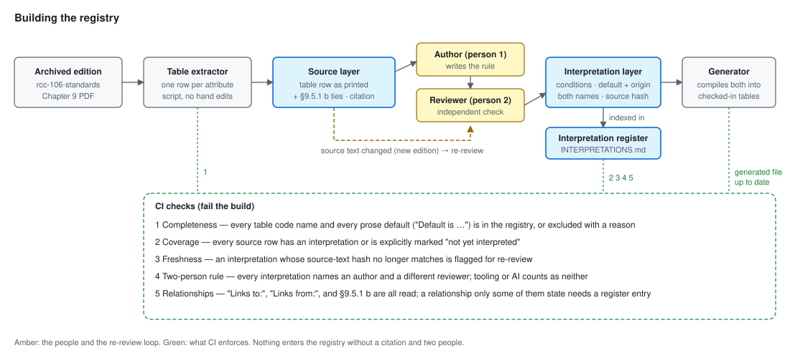
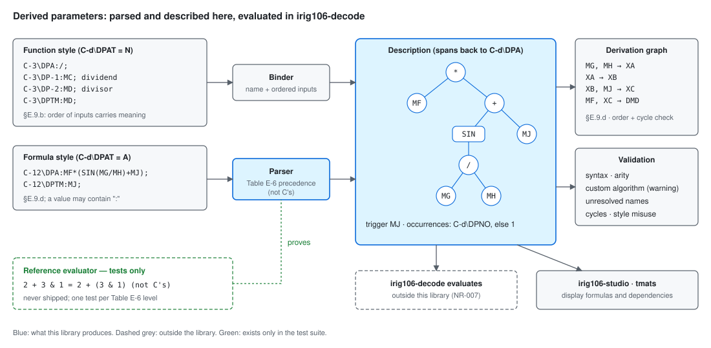
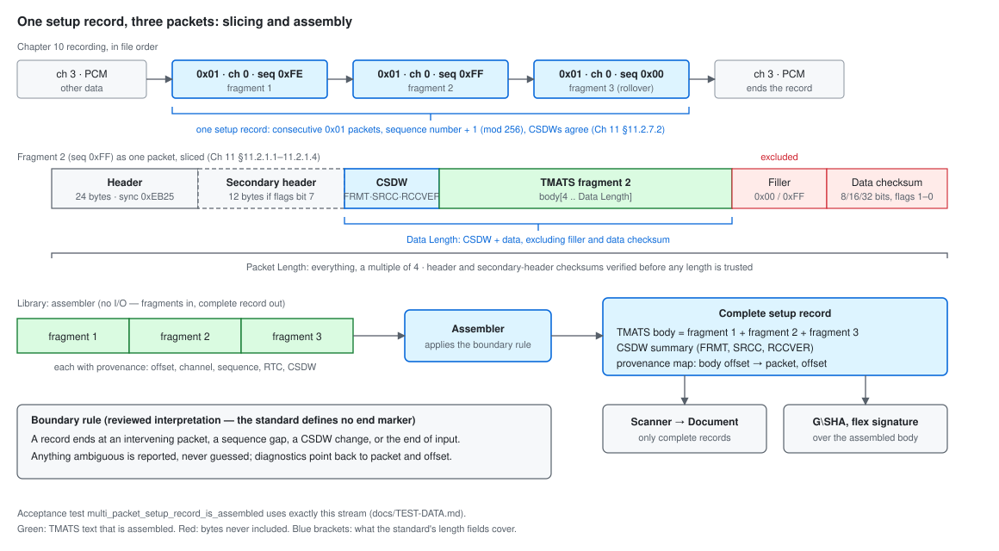
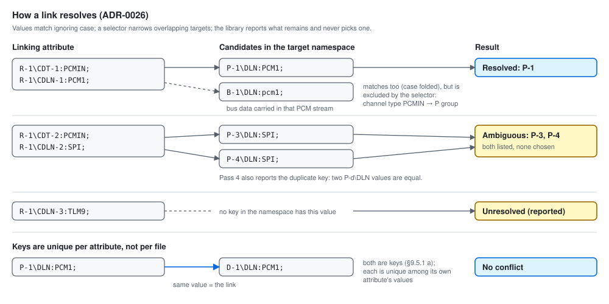

# irig106-tmats — Architecture

> **Status: draft for review (design phase).** This document replaces the
> prototype's architecture notes (preserved at the git tag `prototype-0`).
> Section 2 records the architecture proposal **word for word** as it was
> made in the design discussion on 2026-09-25; later sections will refine it
> into modules, data flow, and interfaces. The decisions are recorded in
> `docs/adr/` (ADR-0020 and ADR-0021 capture this proposal, pending review). Use cases are in `docs/USE-CASES.md`.

## 1. Direction from the project owner

> "I dont necessarily want to follow the legacy tools Pipeline sketch. Lets
> make our architecture better, faster, less error prone. What can we do
> better here?"

The "legacy tools pipeline sketch" is the one proposed in the owner's
ChatGPT conversation (recorded verbatim, with verification notes, in
`docs/research/2026-09-25-irig106org-tools.md`):

```text
Chapter 10 packet
      │
      ▼
TMATS packet 0x01
      │
      ▼
raw TMATS text
      │
      ▼
TMATS lexer/parser
      │
      ├── G records
      ├── R records
      ├── M records
      ├── P records
      ├── B records
      ├── C records
      ├── D records
      └── ...
      │
      ▼
structured TMATS model
      │
      ├── raw view
      ├── tree view
      ├── channel mapping
      └── semantic lookup
```

Its overall flow (packet → text → parse → model → views) is sound; its "one
record type per group" model is the design that failed in the prototype, and
is not adopted.

## 2. The proposal (verbatim, 2026-09-25)

### A better architecture than the legacy pipeline

Here's what `idmptmat` and `irig106lib` actually do, from their source:
1. Copy the packet's text.
2. Split it into lines with `strtok`, into fixed 2 KB buffers.
3. Make an upper-cased copy of every line.
4. Match each code name against hand-written, per-group decoder files (`i106_decode_tmats_r.c` and so on) into linked lists of C structs that hold only the fields someone thought to decode.
5. Walk those lists to print.

Every stage loses information or invites bugs. Unknown fields are dropped, the linked-list walk hangs (D1), the signature re-reads the text on its own path with its own bugs (D5, D6), only the first packet is read (D2), and the first error aborts.

Here's what I'd do instead, organised around one principle: **read the bytes once, never copy them, and let the spec's own tables drive everything else.**

```text
bytes ──► 1 scan ──► Document (immutable, one owned buffer)
                      ├─ items: [ {code span, value span, parsed key} ]   flat, in order
                      ├─ keys:  interned, case-folded structured code names
                      ├─ index: key → item ids   (built during the scan)
                      ├─ digest: G\SHA SHA-256   (computed during the same scan)
                      └─ diagnostics: [ {span, kind} ]   (never aborts)
                                │
     spec-cited registry ───────┼──► link graph (from the spec's "Links to/from")
     (static tables +           │
      user overlay)             ├──► typed views: Recorder, Channel, PcmFormat…
                                │     (borrow the document, parse values lazily)
                                ├──► validator (rules = registry data + policy)
                                └──► edits = patch list over the original bytes
                                      └──► writer: original bytes + patches
```

**Faster**
1. **One pass, no copies.** A byte scanner (`memchr` for `:` and `;`, vectorised) records spans into one owned buffer. There are no per-line allocations and no upper-cased copy of the file. Case-insensitivity is handled once, when each code name is folded into a compact key (group, occurrence, interned path, indices).
2. **Index while scanning.** Every lookup is a hash probe; pattern lookups like "every `R-1\TK1-n`" hit a secondary index. There are no linked lists to walk, which rules out the whole class of bug behind D1.
3. **Checksum during the same pass.** `G\SHA`'s excluded span is known at scan time, so the SHA-256 is computed on the fly without re-reading the file (fixing D5 and D6 by construction).
4. **Parse values only when asked.** Views hand back spans and decode numbers, keywords and dates only when someone reads them. Showing the raw text or a tree never parses a value.
5. **A static registry with no start-up cost.** It's generated as sorted, compile-time tables (binary search or a perfect hash), unlike the prototype's `OnceLock<HashMap>` built at runtime. User definitions sit in a small runtime overlay that's checked first.
6. **The CLI reads large recordings efficiently.** It memory-maps the file and skips from packet header to packet header, reading only `0x01` payloads, so finding every setup record in a multi-gigabyte file costs very little.

**Less error-prone**
7. **One source of truth, generated from the spec.** Views, links and validation all come from the spec-cited registry, whose "Links to / Links from / Allowed when / Range" fields are Chapter 9's own. The hand-written per-group decoders, where both the legacy code and the prototype went wrong, disappear.
8. **Values are bytes, not `str`.** A Latin-1 `°` can't fail a parse. Decoding is explicit (`as_str_lossy`, `as_latin1`) and happens at the view.
9. **Errors are data, with locations.** Reading never fails partway through; it returns the document plus diagnostics. "Strict" becomes a policy you apply to the diagnostics, not a separate parser mode, so there's no second code path to drift.
10. **Byte-faithful by construction.** Edits are a patch list over the original bytes, so output is the original with the patches applied. Undo, diffing and "did the checksum change?" all fall out of the patch list.
11. **Guard rails in the code:**
    - `#![forbid(unsafe_code)]`;
    - newtype IDs (`ItemId`, `Span`) so indices can't be mixed up;
    - no panicking indexing;
    - `#[non_exhaustive]` on public enums;
    - an immutable, `Send + Sync` document that's safe to share across threads.
12. **Proven, not asserted:**
    - fuzzing from the first commit;
    - property tests: the scan never panics, a round trip is byte-identical, and the index agrees with the item list;
    - the D1–D7 regression tests;
    - semantic comparison against `idmptmat` on real files, run locally.

**Better for users**
13. **Every setup record, as a sequence:** `SetupRecords` yields each one in turn, each with its CSDW facts.
14. **Stable machine output:** the CLI's JSON is a documented schema, so scripts and `irig106-cli` can rely on it.
15. **Performance budget:** a benchmark suite on the sample recordings from day one, reporting throughput next to `idmptmat` on the same files. I'd set the numeric target after the first measurement, not guess it now.

Each of these becomes an ADR and part of `docs/ARCHITECTURE.md`, which is the next design document.

## 3. The architecture in pictures

Hand-authored SVGs in `docs/diagrams/`; they follow GitHub's light or dark
theme on their own. Each shows one mechanism.


*Context.* The `tmats` CLI is the only part that opens files: it
memory-maps a Chapter 10 recording, slices each setup-record packet, and hands
the fragments (or a standalone TMATS file's bytes) to the library, whose
assembler joins fragments into complete setup records (section 6). CLI and library are one
workspace released in lockstep; the sibling crates, including the complete
`irig106-cli`, depend on the library; shared types come from
`irig106-types`; `irig106-core` will later replace the CLI's packet reader.


*What changes.* The legacy path copies and upper-cases the text, decodes only
the fields someone hand-wrote, walks linked lists, and re-reads the text for
the checksum; each red box is where it loses data or has a defect (D1–D7).
The new path scans once into a lossless document and derives everything
else from it and from the spec registry.


*Data flow* (updated for T1, section 4). The Document and the registry meet
in the effective-value resolver and the condition evaluator; views and the
validator read everything through them. The registry holds source text and
reviewed interpretations, with the user's overlay checked first. The link
graph is built before validation, and validation runs four passes. The only
paths that change anything are amber: the user's overlay and the caller's
choice of suggested edits. The writer is the original bytes plus the chosen
patches.


*Document model.* The bytes are kept once; each item is a pair of spans plus a
parsed, case-folded key; an index maps keys and patterns to items; the
`G\SHA` digest covers every byte except the `G\SHA` item (Chapter 6
§6.2.3.11 f) and is computed in the same pass.


*Link graph.* The ties between groups that Chapter 9 §9.5.1 b defines, each
labelled with the attribute value that carries it. The link graph and the
channel views (UC-05) are built from these, as recorded in the registry from
three sources — the "Links to:" and "Links from:" fields and the ties of
§9.5.1 b (section 8); X attributes attach to the attribute they extend
(§9.5.14). The H group has no table to transcribe: the standard defines only
`H\TA`, which "ties the H group to the G group", and `H\ST-n`, and reserves
the rest for organisations (§9.5.12).


*Edits and the checksum.* A chosen edit becomes a patch over the original
bytes, and the writer copies every other byte unchanged. The checksum of the
result no longer matches the stored `G\SHA`, so the library reports it stale
and suggests a stamp edit; `G\SHA` changes only if the caller applies that
suggestion (`tmats stamp` does this on request).

## 4. Refinement T1: executable registry, validation passes, effective values

From the team design review, priority T1 (`docs/ROADMAP.md`, "Team design
review"; text in `docs/research/2026-09-26-team-design-review.md`). Applied
2026-09-26 at the owner's direction; recorded in ADR-0022 and ADR-0023. The
shape of the architecture is unchanged — bytes → single scan → lossless
Document → views and validator ← registry. Two components are deepened and
one is added. This section **amends points 4, 5, 7, and 9 of section 2**,
which stays as the verbatim record of the original proposal.

### 4.1 Registry: source text plus reviewed interpretations (amends point 5)

Each registry entry has two layers:

- **Source layer** — the Chapter 9 table row exactly as printed: parameter
  name, code-name pattern, the usage-attribute text, and the definition prose,
  with its citation (edition, table, page). Produced by the table extractor;
  never edited by hand. Prose-only facts survive here, such as `C-d\DPNO`'s
  "Default is 1." (Table 9-11), which has no `Default:` field.
- **Interpretation layer** — what the code executes: Allowed-when and
  Required-when as expressions in a small, defined **condition language**;
  the default and its origin (a `Default:` field or the prose); typed ranges;
  links. Each interpretation records its **author and an independent
  reviewer** (two people; tooling or AI drafting counts as neither), the
  review date, a note wherever it is not literal (for example "`C\DCT` in
  `C-d\DPNO`'s condition means `C-d\DCT` of the same occurrence"), and a
  **hash of the source text** it interprets.

Both layers are generated into the static tables of point 5; conditions are
compiled, so the registry still has no runtime set-up cost. The user overlay
supplies entries of the same shape.



*Building the registry.* The extractor produces the source layer from the
archived edition; people author interpretations and a second person reviews
each; the generator compiles both into checked-in tables. Four CI checks
guard it (a fifth, on relationships, was added by T5 — section 8.2): every table code name and prose default is in the registry
(completeness); every source row is interpreted or explicitly marked "not
yet interpreted"; an interpretation whose source text hash changed is
flagged for re-review; and every interpretation names two different people.

### 4.2 Condition semantics

Defined once, not per rule:

- **Occurrence scope.** Each condition declares whether its operands refer to
  the same occurrence, a linked occurrence, or the whole document.
- **Links.** A condition may follow a registry link (for example from a D
  group to the P group it describes); the link graph is therefore built
  before conditions are evaluated.
- **Missing or invalid dependencies.** A condition whose operand is missing
  or invalid evaluates to **cannot evaluate**, reported as its own finding —
  never silently true or false.
- **Defaults.** Each condition declares whether it sees defaulted values or
  only explicit ones.

The **condition evaluator** implements these rules and returns true, false,
or cannot-evaluate, with the operands it used.

### 4.3 Effective values (amends point 4)

Views and the validator read values through an **effective-value resolver**
between the Document and the registry. Every read returns one of five
states, and the stored bytes are never changed (ADR-0002):

| State | Carries |
|-------|---------|
| Explicit | the value and its location in the bytes |
| Defaulted | the default and the citation it came from |
| Missing | nothing present and no default |
| Invalid | the raw text and why it failed |
| Ambiguous | the conflicting candidates (for example disagreeing duplicates) |

Values are still parsed only when asked for.

### 4.4 Validation in four passes (amends point 7)

Validation runs four passes, in order, each over the Document, the link
graph, and the registry through the condition evaluator and the resolver:

1. **Present attributes** — each is known, allowed where it appears, and
   within its range and type.
2. **Presence** — every Required-when and R/R Ch 10 Status rule is evaluated
   for each occurrence it applies to. This pass reports attributes that are
   absent, such as a missing `G\106` ("Required when: Always", Table 9-2);
   a pass over present attributes alone cannot.
3. **Counters and indices** — each `\N` counter agrees with its entries, and
   indices run "with no missing values" (§9.5.1 a).
4. **Relationships** — links resolve and key values are unique.

Every finding names its pass. Severity policy, user rules, and the Chapter 10
recorder profile apply as before (ADR-0006). Diagnostics gain one kind,
**cannot evaluate** (amends point 9).

### 4.5 Cost

The presence pass iterates registry rules per group occurrence rather than
only the attributes present. The rules are compiled and static and TMATS
documents are small, so the cost is expected to be negligible; the benchmarks
of point 15 measure it.

## 5. Refinement T2: derived parameters (Appendix 9-E)

From the team design review, priority T2 (`docs/ROADMAP.md`). Applied
2026-09-26 with the owner's decision on scope; recorded in ADR-0024. It adds
one component to the read-through layer, a dependency graph beside the link
graph, and a scanner rule (**amends point 1 of section 2**).

### 5.1 Scope

The library **parses, validates, and describes** derived parameters;
`irig106-decode` **evaluates** them. Evaluation needs measurement values over
time, trigger timing, and numeric policy (division by zero, the `pow` error
conditions of Table E-9), none of which this I/O-free library sees
(ADR-0010). Engineering-unit conversion and the interpretation of
floating-point bit patterns (Appendix 9-D) stay with `irig106-decode` for the
same reason (NR-007).

### 5.2 The derived-expression component

For every C group whose `C-d\DCT` is `DER`:

- **Formula style** (`C-d\DPAT` = `A`): a hand-written lexer and parser for
  the Appendix 9-E grammar. Precedence and associativity follow Table E-6
  exactly — which differs from C: `& ^ |` bind tighter than `* / %`, and
  `+ -` tighter than `<< >>` — cross-checked against the Yacc declarations of
  the appendix's grammar figures, which agree with the table. Tokens follow
  §E.4–E.5: measurement names of alphanumerics and `$ _ .`, names quoted with
  `"` or `'`, decimal, hexadecimal (`0x…`), and scientific constants,
  case-insensitive throughout.
- **Function style** (`C-d\DPAT` = `N`): a binder that pairs the operator,
  function, or custom-algorithm name in `C-d\DPA` with the ordered inputs
  `C-d\DP-n` and constants `C-d\DPC-n` (order carries meaning; for division
  the first input is the dividend, §E.9.b).
- **Output**: an interpretable description — an expression tree or a bound
  call — whose nodes carry spans back to the `C-d\DPA` bytes, the trigger
  (`C-d\DPTM`, or the single input when there is one input and no trigger,
  §E.9.c), and the number of occurrences (`C-d\DPNO`, read as an effective
  value with its prose default of 1).
- **Validation** (in the four passes of section 4.4): syntax errors with
  locations; arity of the functions Table E-9 lists; names not in that
  "selected" list reported as custom algorithms (a warning); inputs and
  constants used only in the style that allows them; unresolved measurement
  names; cycles among derived measurements.
- **Errata**, read through the two-person interpretation review: `==` is the
  equality operator (the grammar is the machine-readable source), and `= =`
  as printed in Table E-3 is accepted with a warning.

### 5.3 Dependencies

Derived measurements appear only in the C group and may depend on telemetry
measurements (R, M, D, B, S groups) and on other derived measurements
(§E.1, §E.5; §E.9.d chains `XA` → `XB` → `XC` → `DMD`). The read-through
layer holds a **derivation graph** beside the link graph: for each derived
measurement, what it reads, resolved to its defining group, with cycle
detection. Consumers get evaluation order from it without re-parsing.



*Derived parameters.* Both styles become one description with a trigger and a
derivation graph; validation reports syntax, arity, custom algorithms,
unresolved names, and cycles; `irig106-decode` evaluates, while
`irig106-studio` and `tmats` display. The evaluator exists only in the tests.

### 5.4 Scanner rule (amends point 1)

A colon may appear inside a value: Appendix 9-E's own example is
`A<B || B<<C ? D : E` (§E.6.b), so `C-1\DPA:A?B:C;` is valid. **The first
colon of an attribute ends the code name; every later colon belongs to the
value**, which ends at the semicolon (semicolons are not allowed in data
items, §9.4.2). Blanks around the code name are ignored for interpretation
and kept in the bytes — the standard's own example `C-6\DCN :DMC;`
(§E.9.c) has one before the colon.

### 5.5 Proving the precedence

A **reference evaluator exists only in the test suite** and never ships. It
proves the parser's precedence by computing values: for example
`2 + 3 & 1` must equal `2 + (3 & 1)`, not `(2 + 3) & 1` as in C. Every
expression and TMATS example in Appendix 9-E (§E.6.b e–h, §E.9.a–d, both
styles) is a test fixture, with one precedence test per level of Table E-6.

## 6. Refinement T3: setup-record packets versus complete setup records

From the team design review, priority T3 (`docs/ROADMAP.md`). Applied
2026-09-26 with the owner's decision that the assembler lives in the library;
recorded in ADR-0025. It adds an assembler in front of the scanner and
specifies how the CLI slices packets.

### 6.1 The problem

"A single setup record may span multiple consecutive packets. When spanning
multiple packets, the sequence counter shall increment in the order of
segmentation of the setup record, n+1" (Chapter 11 §11.2.7.2, 106-24R1). Each
fragment's packet body begins with its own CSDW. Reading each packet on its
own — as UC-02 first said — would split a valid record, break any attribute
that crosses a packet boundary, and compute `G\SHA` over the wrong bytes.



*Slicing and assembly.* One record spans three consecutive `0x01` packets
whose sequence numbers roll over from `0xFF` to `0x00`. Each packet is sliced
by its header, optional secondary header, and Data Length; filler and data
checksum are never included. The assembler joins the fragments into one
complete record with a provenance map; only complete records are scanned,
and `G\SHA` covers the assembled body. The acceptance test
`multi_packet_setup_record_is_assembled` uses exactly this stream.

### 6.2 Division of work

| Stage | Owner | Input → output |
|-------|-------|----------------|
| Packet reading and slicing | the `tmats` CLI's reader (later `irig106-core`) | file → packets → fragment bytes with provenance |
| Assembly | **the library** (no I/O) | fragments with provenance → complete setup records |
| Reading | the library (scanner, section 2 point 1) | complete record → Document |

The assembler takes bytes and provenance, never files, so it is consistent
with ADR-0010 and reusable unchanged by `irig106-ch10-reader`,
`irig106-studio`, and `irig106-core`.

### 6.3 Slicing rules (the CLI's reader)

From Chapter 11 §11.2.1.1–11.2.1.4: the 24-byte header begins with sync
`0xEB25`; a 12-byte secondary header follows when packet-flags bit 7 is 1;
the packet body starts after them; Data Length covers the CSDW and the data
and excludes filler and the data checksum; the TMATS fragment is the body
from offset 4 to Data Length. The header checksum and, when present, the
secondary-header checksum are verified before any length field is trusted;
the data checksum (8, 16, or 32 bits per packet-flags bits 1–0) is verified
and reported when present.

### 6.4 Assembly contract (the library)

- **In:** fragments in file order, each with its bytes and provenance — file
  offset, channel ID, sequence number, relative time counter, the CSDW fields
  (FRMT, SRCC, RCCVER), and the data-type version.
- **Out:** complete setup records, each with the concatenated TMATS body, one
  CSDW summary, and a **provenance map** from every body offset back to its
  packet and offset, so every diagnostic can name the packet it came from.
- **Boundary rule** (a reviewed interpretation, because the standard defines
  no end-of-record marker): a record is a run of consecutive data type `0x01`
  packets on one channel whose sequence numbers increase by one modulo 256 and
  whose CSDWs agree on FRMT and RCCVER. It ends at an intervening packet, a
  sequence gap, a CSDW change, or the end of input. Anything ambiguous is
  reported, never guessed.
- **Checksums:** `G\SHA` and the flex signature are computed over the
  assembled body.

### 6.5 Session rules and edition codes

Across the complete records of one recording: ASCII and XML are never mixed
("It is not permissible to have both ASCII and XML Chapter 9 TMATS attributes
in the same session"); a record with SRCC = 1 is preceded by a
configuration-change event packet; from 106-17, setup records are on channel
`0x0000`. RCCVER defines `0x07` (106-07) to `0x0E` (106-22) and reserves the
rest, so `0x0E` reads as "106-22 or later" and reserved values as unknown;
`G\106` remains the primary edition source (ADR-0016).

### 6.6 Channel IDs

`R-x\NSB` gives the number of high-order channel-ID bits that identify a
multiplexer source (Chapter 11 §11.2.1.1 b). Channel views (UC-05) split
channel IDs accordingly.

## 7. Refinement T4: counters, keys, links, and comparison

From the team design review, priority T4 (`docs/ROADMAP.md`). Applied
2026-09-26 at the owner's direction; recorded in ADR-0026. It makes the
interpretation layer (section 4.1) declare counters and links precisely, and
gives passes 3 and 4 of section 4.4 exact rules. The shape of the
architecture is unchanged.

### 7.1 Counter declarations

Every `\N` counter in the registry declares:

- the **code pattern and index position it governs** — `D-x\MML\N-y-n`
  governs the location index `m` of `D-x\MNF\N-y-n-m` and of the other
  `-y-n-m` attributes;
- its **parent scope**, the indices held fixed — `D-x\MNF\N-y-n-m` counts
  the fragments `e` of one location `m` of one measurand `n` in measurement
  list `y` (as in `D-x\WFP-y-n-m-e`), so contiguity
  is checked separately for every parent-index combination (106-24R1
  Chapter 9 has 49 such nested counters, for example `Q-d\NSF\N-i-n-m-o`);
- whether its indices run **from 1 to N "with no missing values"**
  (§9.5.1 a), or carry a cited exception. The one exception found is the X
  group: "The values of "x" in "X-x" are not necessarily contiguous"
  (§9.5.14).

Pass 3 checks each counter against its entries per parent combination. A
condition naming a counter without indices ("Allowed when: D\MNF\N > 1") uses
the occurrence scope of section 4.2.

### 7.2 Link declarations and resolution

Every link in the registry declares:

- its **source** attribute and its **target namespace** — the key
  attributes it may resolve to, built from both the "Links to:" and the
  "Links from:" fields of Chapter 9. The two sides do not always agree:
  `R-x\CDLN-n` lists "Links to: P-d\DLN, B-x\DLN, S-d\DLN", while
  `Q-d\DLN` lists "Links from: R-x\CDLN". Each disagreement is settled in a
  reviewed interpretation (ADR-0022), never by the code;
- a **selector** where targets overlap. `B-x\DLN` is linked from both
  `R-x\CDLN` and `P-d\DLN`, so bus data carried in a PCM stream shares the P
  group's data-link name, and a recorder channel naming it matches both. The
  channel data type (`R-x\CDT-n`) of the same channel selects the group;
- its **cardinality** — exactly one, at most one, or many.

The link graph (section 4.2) resolves every link to one of three results, and
no link is silently dropped or silently chosen:

| Result | Meaning |
|--------|---------|
| Resolved | exactly one candidate remains after the selector |
| Unresolved | no candidate (L1-VIEW-003) |
| Ambiguous | several candidates remain; all are listed, none is chosen |

An ambiguous link makes every value read through it ambiguous (section 4.3).



*Link resolution.* A recorder channel's data-link name matches a P group and,
ignoring case, the B group of bus data carried in that PCM stream; the
channel-type selector keeps P, so the link resolves. Two P groups with the
same name leave two candidates: the link is ambiguous, both are listed, and
pass 4 reports the duplicate key. A name with no key is unresolved. `P-1\DLN`
and `D-1\DLN` holding the same value is the link itself, not a conflict.

### 7.3 Key uniqueness

"Any attribute with a Links from: is a key and must be unique in the TMATS
file" (§9.5.1 a) cannot mean that every key differs from every other:
`P-d\DLN` and `D-x\DLN` are both keys and are linked **because** they hold the
same value. A key is unique **among the values of the same attribute**, in
the scope the registry declares — the whole document for `P-d\DLN`, one
parent occurrence for a nested key. Equal values across linked attributes
are the link, not a conflict. Pass 4 reports duplicate keys, and links into
a duplicated key are ambiguous rather than resolved to the first match.

### 7.4 Comparison rules

"For alphanumeric data items, including keywords, either upper or lower case
is allowed; TMATS is not case sensitive" (§9.4.2). Code names, keywords, and
link values are compared with **ASCII case folding**; the stored bytes keep
the original spelling. Blanks inside values are significant (they are
compared as written).

### 7.5 A colon where a semicolon is meant (suspect)

The standard's own example contains 18 attributes ended with `:` instead of
`;` (Appendix 9-C, page C-8, 106-17 onward), for example
`D-1\MML\N-1-1:2: D-1\MNF\N-1-1-1:1: D-1\WP-1-1-1-1:14;`. Under the rule of
section 5.4 this is one attribute whose value holds the next two. The scanner
keeps it exactly so and, when a colon inside a value is followed by a
complete code name and its own colon, reports **"possible `;` typed as `:`"**
as a warning with a suggested edit (ADR-0007). A colon in a derived
expression (`C-1\DPA:A?B:C;`) is not followed by a code name and is not
reported. The owner holds this finding **suspect** until it is checked
against real recordings (`docs/ROADMAP.md`, "Suspect findings", S1).

## 8. Refinement T5: the interpretation register and three-source relationships

From the team design review, priority T5 (`docs/ROADMAP.md`). Applied
2026-09-26 with the owner's decision to start the register now; recorded in
ADR-0027. It adds a register beside the registry and a third input to the
registry generator.

### 8.1 The interpretation register

`docs/INTERPRETATIONS.md` lists every place where the standard is
inconsistent, incomplete, or silent and the design had to choose: the
sources quoted verbatim, the behaviour, the reason, the design status
(accepted or suspect), the two-person review (ADR-0022), and a focused test.
Tests name their entry (`/// Interpretations: INT-NNN`), and the trace
matrix lists each entry with its tests. Code relies only on listed
interpretations. When the registry's interpretation files exist, the
register is generated from them.

The registry pipeline diagram (section 4.1) shows where the register sits:
interpretations are written and reviewed in the interpretation layer, the
register is their human-readable index, and CI check 5 requires a register
entry for every relationship that only some of its sources state.

### 8.2 Relationships from three sources

Chapter 9 claims that "All valid paths are documented in "Links to:" and
"Links from:" attributes" (§9.5.1 b). They are not:

| Relationship | "Links to:" | "Links from:" | §9.5.1 b | Register |
|--------------|-------------|---------------|----------|----------|
| `R-x\CDLN-n` → `Q-d\DLN` | omits Q | lists R | (h) states it | INT-001 |
| sub-channel and network names → B, S, Q | no field | not listed | (g), (h) state it | INT-002 |
| `P-d\DLN` → `B-x\DLN` | "B-d\DLN" | lists P | (e) states it | INT-004 |
| `H\TA` → `G\TA` | no table | no table | not listed; §9.5.12 states it | INT-006 |

The registry generator takes the union of the three sources as candidates,
uses only reviewed definitions, and fails when a relationship that only some
sources state has no register entry. The resulting declarations feed the
link resolution of section 7.2 unchanged.

### 8.3 What the extractor reports

The table extractor never assumes the tables are complete. Besides the
coverage count (ROADMAP coverage item 1) it reports: links naming code names
no table defines; conditions naming unknown attributes or keywords (the Q
group's `FBCIN`, INT-007); and attributes defined only in prose (`H\TA`,
`H\ST-n`).

### 8.4 The H group

"The only H group attributes defined in this standard are" `H\TA` and
`H\ST-n`; the rest is reserved "for those instrumentation organizations that
choose to use the TMATS standard in this way" (§9.5.12), and §9.7 says the
group "has never been implemented", IHAL having taken its purpose. `H\TA`
and `H\ST-n` are built in, `H\TA` links to `G\TA`, and every other H
attribute is organisation-defined: supplied through the user overlay like
the V group (ADR-0008) and preserved, reported as undefined, when no
definition is given.

## 9. Decisions this architecture must honour

Recorded as ADRs in `docs/adr/` (0001–0019, 0022–0027 accepted): the lossless ordered attribute store as the
single source of truth; owned storage instead of borrowed lifetimes; the
layered, spec-cited registry generated by a script (no `build.rs`);
registry-driven validation with severity policy and user rules; no automatic
repair (suggested edits, explicit apply); first-class V and X groups; shared
ecosystem types from `irig106-types`; the two-crate lockstep workspace
(`irig106-tmats` and `irig106-tmats-cli`, binary `tmats`); a minimal Chapter
10 packet reader inside the CLI until `irig106-core` provides one; `G\SHA`
over the original bytes and the flex signature as a labelled compatibility
option; no I/O in the library; the edition strategy; the two-layer registry
with reviewed interpretations and defined condition semantics (ADR-0022);
validation in four passes over effective values (ADR-0023); derived
parameters parsed, validated, and described here and evaluated in
`irig106-decode` (ADR-0024); setup records assembled from their packet
fragments in the library, with packet slicing in the CLI's reader
(ADR-0025); counters with declared scopes, links with declared namespaces,
selectors, and cardinality, keys unique per attribute, and case-insensitive
comparison of code names, keywords, and link values (ADR-0026); an
interpretation register, relationships generated from three sources, and the
H group's two built-in attributes (ADR-0027). The original
proposal is captured in ADR-0020 and ADR-0021 (proposed).

## 10. To be written

- Module structure and public API sketch (document, scanner, keys and
  index, registry and overlay, link graph, condition evaluator,
  effective-value resolver, derived-expression parser and derivation graph,
  views, validator, edits and writer, checksums,
  Chapter 10 setup-record assembler, CLI packet reader).
- The condition language's grammar and the interpretation file format.
- Data flow per use case (UC-01 … UC-17).
- Error and diagnostic model; JSON output schema for the CLI.
- Performance and memory budget, set after the first benchmark.
