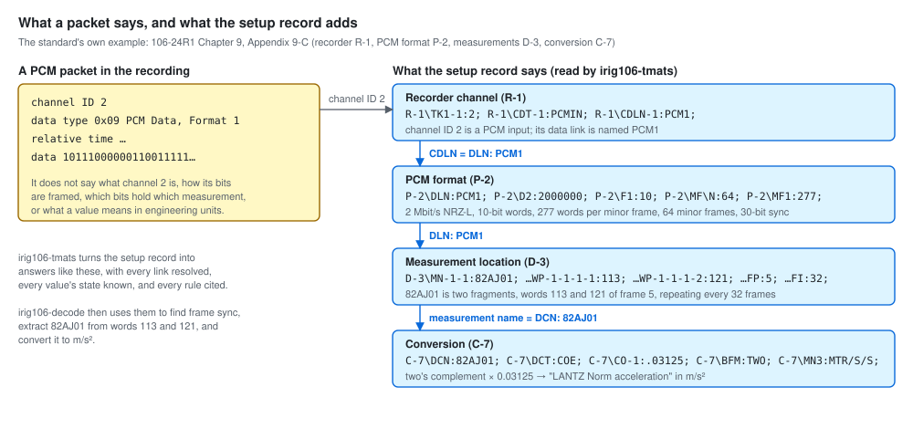
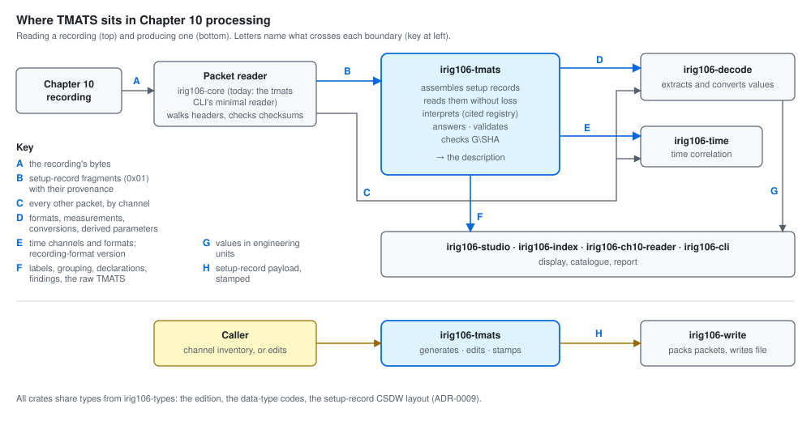
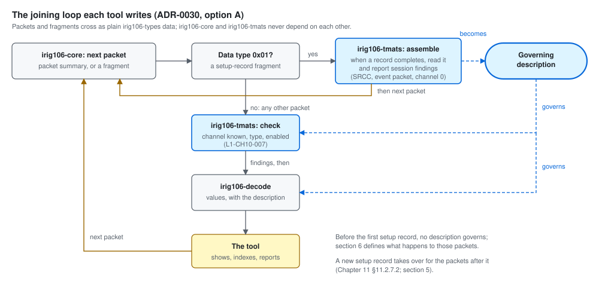
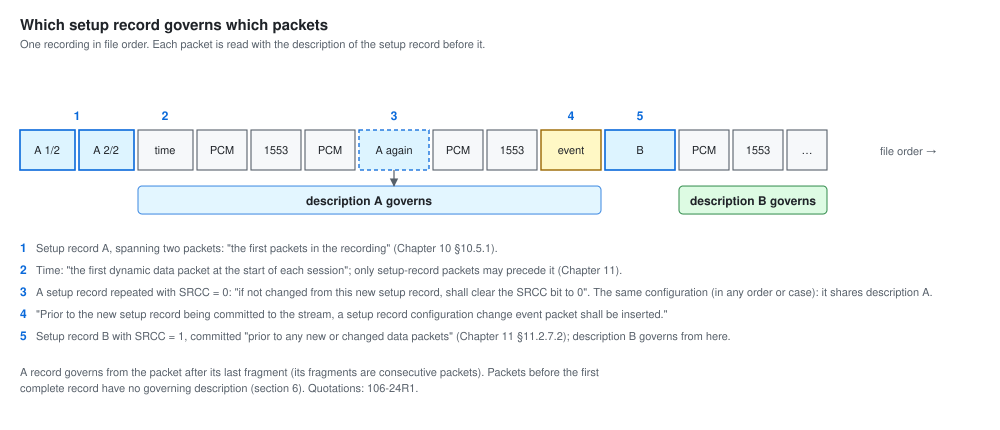

# What TMATS gives Chapter 10 processing

> **Status: design draft, written one section at a time for the owner's
> review** (follow-up F4 in `docs/ROADMAP.md`; outline approved 2026-09-26).
> Every attribute, rule, and quotation is taken from the archived standard
> (`TelemetryWorks/rcc-106-standards`; baseline 106-24R1) and cited. What the
> other repositories expect today is recorded in
> `docs/research/2026-09-26-consumer-survey.md`.

## Contents

| Section | Status |
|---------|--------|
| 1. What `irig106-tmats` is for | **draft for review** |
| 2. Where TMATS sits in Chapter 10 processing | **draft for review** |
| 3. What the description answers, question by question | **draft for review** |
| 4. Contracts per consumer | **draft for review** |
| 5. Configuration over a recording | **draft for review** |
| 6. When TMATS is missing, wrong, or disagrees with the data | to be written |
| 7. A worked example: Appendix 9-C from channel to engineering units | to be written |
| 8. What changes as a result | to be written |

---

## 1. What `irig106-tmats` is for

### 1.1 The problem: packets carry data, not meaning

A Chapter 10 recording is a sequence of packets. Each packet header gives
the channel ID, the data type, lengths, a sequence number, flags, and a
relative time; the body holds the data (Chapter 11 §11.2.1, 106-24R1). None
of that says **what** the data is. A packet on channel ID 2 with data type
`0x09` ("PCM Data, Format 1", Table 11-4) is a run of bits; nothing in it
says how those bits are framed, which of them hold which measurement, or
what a value means in engineering units.

That knowledge is in the **setup record**:

> "Format 1 defines a setup record that describes the hardware, software,
> and data channel configuration used to produce the other data packets in
> the file." — Chapter 11 §11.2.7.2

Its content is TMATS, Chapter 9:

> "Telemetry attributes are those parameters required by the
> receiving/processing system to acquire, process, and display the
> telemetry data received from the test item/source." — Chapter 9 §9.1

The setup record is a **required** packet type (Chapter 11 Table 11-3) of
data type `0x01` ("Computer-Generated Data, Format 1 — Setup Record",
Table 11-4), carried from 106-17 on channel ID `0x0000`, a channel that may
also carry Format 4 streaming configuration records (§11.2.1.1 b). One
record may be up to 134,217,728 bytes and may span several consecutive
packets (§11.2.1 c, §11.2.7.2); a recording may carry more than one
record when the recorder's configuration changes (§11.2.7.2, SRCC).

*The standard's own example* (106-24R1 Chapter 9, Appendix 9-C). A PCM
packet on channel ID 2 says only that it holds PCM bits. The setup record
says that channel 2 is a PCM input whose data link is named `PCM1`
(`R-1\TK1-1:2; R-1\CDT-1:PCMIN; R-1\CDLN-1:PCM1;`); that `PCM1` is a
2 Mbit/s NRZ-L stream of 10-bit words, 277 words per minor frame and 64
minor frames with a 30-bit sync pattern (`P-2`); that measurement `82AJ01`
is two fragments at words 113 and 121 of frame 5, repeating every 32 frames
(`D-3`); and that `82AJ01` is a two's-complement value multiplied by
0.03125, "LANTZ Norm acceleration" in m/s² (`C-7`). Without the setup
record the packet cannot be decoded; with it, every step is defined.
Section 7 follows this chain in full.

### 1.2 What `irig106-tmats` does

**`irig106-tmats` is the one place in the ecosystem where the setup record
is understood.** It turns the setup records of a recording — or a TMATS
file — into a verified, queryable **description of the recording**, and it
is the only component that reads, checks, changes, or produces TMATS.

| Step | What the library does | Decided in |
|------|-----------------------|------------|
| Assemble | Joins setup-record fragments, supplied by the caller with their provenance, into complete setup records, or accepts TMATS text | ADR-0025; L1-CH10-001, 004 |
| Read | Reads every attribute exactly as written — known, unknown, vendor, extension, duplicate, or malformed — and reports every problem without stopping | ADR-0002, 0003, 0021; L1-READ |
| Interpret | Gives each attribute its meaning from a registry built from the cited Chapter 9 tables, with reviewed interpretations where the standard is unclear | ADR-0022, 0026, 0027; `docs/INTERPRETATIONS.md` |
| Answer | Presents channels, formats, measurements, conversions, and derived parameters, following the links between groups | ADR-0024, 0026; L1-VIEW, L1-DER |
| Check | Validates against an edition, stating which edition's rules were applied and why; verifies `G\SHA` | ADR-0023, 0028, 0014; L1-VAL, L1-EDN, L1-SUM |
| Change and produce | Edits as verified transactions, stamps `G\SHA`, generates TMATS from a channel inventory, builds the setup-record payload | ADR-0007, 0029; L1-WRT, L1-CH10-003 |

The **description** that consumers receive is: the document (every
attribute, as read, with its location); the answers built over it (channel,
format, measurement, conversion, and derived-parameter views); the
declarations it carries (the TMATS edition, each setup record's
recording-format version, the checksum); and every diagnostic found along
the way.

### 1.3 What it deliberately does not do

| Not done here | Done by | Why |
|---------------|---------|-----|
| Open files; read packets other than setup-record fragments | the caller — today the `tmats` CLI's minimal reader, later `irig106-core` | The library performs no I/O (ADR-0010, ADR-0019; ROADMAP X3) |
| Decode packet data; extract measurement values; apply conversions; evaluate derived parameters; interpret floating-point formats | `irig106-decode` | It needs data over time and numeric policy that a description does not have (ADR-0024; NR-007; ROADMAP X6) |
| Handle time (time packets, time formats, correlating relative time) | `irig106-time` | Separate concern; TMATS only says which channels and formats are involved |
| Write packets or files | `irig106-write` | The library builds the setup-record payload only (L1-CH10-003) |
| XML TMATS, DDML, IHAL | deferred | ADR-0015, NR-001; Chapter 9 §9.6–9.7 |
| Decide what is fatal | the caller | Reading and validation report; the caller decides (UC-14) |
| Repair anything by itself | nobody | Fixes are suggested edits the caller chooses (ADR-0007) |

### 1.4 Who relies on it

| Consumer | What it needs from the description | Today (survey) |
|----------|-----------------------------------|----------------|
| `irig106-decode` | For each channel: the format its data follow, where each measurement is, how each converts, how derived parameters are defined | Placeholder; needs stated nowhere yet |
| `irig106-core` | What each channel ID is (data type, enabled) to check packets against the configuration; setup-record fragments to hand over | Placeholder |
| `irig106-time` | Which channels carry time, in what format; the recording-format version | Reads the CSDW version byte only |
| `irig106-studio` | Channel labels, data-source grouping, the edition, the raw text, findings | Real code; parses nothing yet (its TMATS changes: studio `docs/TMATS-ISSUES.md`) |
| `irig106-ch10-reader` | Presence, size, configuration changes, a summary | Presence check only |
| `irig106-index`, `irig106-cli` | Channel and measurement catalogues per setup record | Placeholders |
| `irig106-write` | Generated or edited TMATS, stamped, as a setup-record payload | Placeholder |

Section 4 turns each row into a contract.

### 1.5 Promises every consumer can rely on

1. **Nothing is lost.** Every byte and attribute of the setup record is
   kept, in order; output is byte-identical unless the caller asks
   otherwise (ADR-0002).
2. **Nothing is silent.** Every value is explicit, defaulted (with the
   citation of the default), missing, invalid, or ambiguous; every link is
   resolved, unresolved, or ambiguous with all candidates listed; every
   problem is a diagnostic with a location (ADR-0023, ADR-0026).
3. **Nothing is guessed.** Where the standard is unclear, the behaviour is a
   reviewed, tested entry in the interpretation register (ADR-0027).
4. **Everything is cited.** Each rule names the edition, table, and row it
   comes from (L1-REG-001).
5. **Editions are stated, not assumed.** The TMATS edition and the
   recording-format version are reported as declared, and every check names
   the edition applied and why (ADR-0028).
6. **Nothing changes without a decision.** The library never alters a
   document except through an edit the caller applies, as a verified
   transaction (ADR-0007, ADR-0029).
7. **No I/O, no global state.** The library works on bytes the caller
   supplies (ADR-0010).

### 1.6 Questions for the next sections

- **Does `irig106-core` depend on `irig106-tmats`?** Checking packets against
  the channel table needs the description; parsing packets does not. Either
  core depends on the library, or a layer above joins them (section 4).
- **Two version code lists.** The packet header's *data type version* uses
  one list ("0x09 = RCC 106-19", "0x0A = RCC 106-22", §11.2.1.1 e) and the
  setup record's RCCVER another ("0x0E = RCC 106-22", §11.2.7.2): the same
  number means different editions in the two fields. Consumers must not
  mix them (sections 3 and 4).
- **Channel `0x0000` is not only TMATS.** From 106-17 it carries setup
  records or Format 4 streaming configuration records, so setup records are
  found by data type `0x01`, never by channel ID alone (sections 4 and 6).
- **One description per setup record.** When a recording's configuration
  changes, consumers need to know which description governs which packets
  (section 5).
- **`irig106-studio` runs as WebAssembly.** ADR-0015 moved the WASM bindings
  out of the library ("WASM returns as a separate `irig106-tmats-wasm`
  crate"); the library's lack of I/O keeps that possible, and section 4 must
  say what studio can rely on until then.

---

## 2. Where TMATS sits in Chapter 10 processing

*Two directions.* Reading a recording (top): a packet reader walks the file,
hands setup-record fragments to `irig106-tmats` and every other packet to
the components that decode them; `irig106-tmats` gives them, and the tools
that present results, the description they need. Producing a recording
(bottom): a caller's channel inventory or edits become a stamped
setup-record payload that `irig106-write` packs into packets. Letters name
what crosses each boundary; section 2.3 defines each.

### 2.1 Reading a recording

1. **A packet reader walks the file** (A). It reads each packet header,
   checks the header checksums before trusting any length, and slices each
   packet body by its Data Length (Chapter 11 §11.2.1; ADR-0025). Today this
   is the `tmats` CLI's minimal reader (ADR-0019); it moves to
   `irig106-core` when that exists (ROADMAP X3).
2. **Setup-record fragments go to `irig106-tmats`** (B). A packet of data type
   `0x01` carries a fragment of a setup record (Table 11-4). The reader hands
   over each fragment's bytes — after the CSDW, without filler or checksum —
   with its provenance: file offset, channel ID, sequence number, relative
   time counter, the CSDW fields, and the data-type version (ADR-0025).
   Finding setup records by data type, never by channel ID alone, matters:
   channel `0x0000` also carries Format 4 streaming configuration records
   from 106-17 (§11.2.1.1 b).
3. **`irig106-tmats` builds the description.** It assembles complete setup
   records ("A single setup record may span multiple consecutive packets",
   §11.2.7.2), reads each one without loss, interprets it through the
   registry, and makes the answers, declarations, checksum status, and
   findings available (section 1.2). One description exists per setup
   record.
4. **Every other packet goes to the component that decodes it** (C), by
   channel ID: data packets to `irig106-decode`, time packets to
   `irig106-time`.
5. **Those components ask the description how to interpret each channel**
   (D, E). `irig106-decode` needs the channel's data type and format
   definition, where each measurement lies, how each converts, and how
   derived parameters are defined; `irig106-time` needs which channels carry
   time, in what format, and the recording-format version (section 3 lists
   the attributes).
6. **Tools present the results** (F, G): `irig106-studio`, `irig106-index`,
   `irig106-ch10-reader`, and `irig106-cli` show labels, groupings,
   declarations, findings, and the raw TMATS from the description, and
   engineering-unit values from `irig106-decode`.

**Order matters.** When a recorder's configuration changes, "the new setup
record packet will be committed to the stream prior to any new or changed
data packets", preceded by "a setup record configuration change event
packet" (§11.2.7.2). A packet is therefore interpreted with the description
of the setup record that precedes it; section 5 defines how a consumer
learns which one that is.

### 2.2 Producing a recording

1. **The caller supplies a channel inventory, or edits** to an existing
   document.
2. **`irig106-tmats` generates or edits the TMATS** as a verified
   transaction: with sufficient input the result validates for the selected
   edition, otherwise it is an incomplete draft with missing-input findings
   (L1-WRT-006, L1-WRT-007); the `G\SHA` stamp is the transaction's last step
   (L1-SUM-004).
3. **It returns the setup-record payload** (H): the CSDW and the TMATS body
   (L1-CH10-003).
4. **`irig106-write` packs the payload into packets and writes the file.**
   A packet may hold at most 524,288 bytes, while a setup record may be up to
   134,217,728 bytes (§11.2.1 c, Table 11-3), so a large record is split
   across consecutive packets whose "sequence counter shall increment in the
   order of segmentation of the setup record, n+1" (§11.2.7.2). For a
   configuration change, `irig106-write` sets the SRCC bit and inserts the
   configuration-change event packet first (§11.2.7.2).

### 2.3 What crosses each boundary

| | From → to | What crosses | Defined in |
|---|-----------|--------------|------------|
| A | recording → packet reader | the file's bytes (memory-mapped) | ADR-0010, ADR-0019 |
| B | packet reader → `irig106-tmats` | setup-record fragments: bytes after the CSDW, and provenance (file offset, channel ID, sequence number, relative time counter, CSDW fields, data-type version) | ADR-0025; L1-CH10-001, 004 |
| C | packet reader → `irig106-decode`, `irig106-time` | every other packet, by channel ID | `irig106-core` (to be designed) |
| D | `irig106-tmats` → `irig106-decode` | for each channel: data type and packing, format definition (PCM frame, bus messages, message data), measurement locations, conversions, derived-parameter descriptions — each with its state | sections 3 and 4 |
| E | `irig106-tmats` → `irig106-time` | the channels that carry time and their formats; the recording-format version declared | sections 3 and 4 |
| F | `irig106-tmats` → presentation tools | channel labels and data-source grouping, the TMATS edition and recording-format version declared, `G\SHA` status, findings, the raw TMATS bytes | sections 3 and 4 |
| G | `irig106-decode` → presentation tools | values in engineering units | `irig106-decode` |
| H | `irig106-tmats` → `irig106-write` | the stamped setup-record payload (CSDW and body) | L1-CH10-003, L1-SUM-004 |

Every boundary carries bytes and plain data, never files or handles: the
library performs no I/O (ADR-0010). Shared types — the edition, the
data-type codes, the setup-record CSDW layout — come from `irig106-types`
(ADR-0009).

### 2.4 Which crate depends on which

Section 1.6 asked whether `irig106-core` depends on `irig106-tmats`.
**Decided (owner, 2026-09-26; ADR-0030): it does not** (ROADMAP follow-up
F5, option A); a crate that joins them may follow later (option C).

| Crate | Depends on | Does not depend on |
|-------|-----------|--------------------|
| `irig106-types` | — | — (holds the plain data that crosses between the crates: setup-record fragments with provenance, packet summaries) |
| `irig106-tmats` | `irig106-types` | any packet reader or decoder |
| `irig106-core` | `irig106-types` | `irig106-tmats` |
| `irig106-decode` | `irig106-types`, `irig106-tmats` (the description's types) | the packet reader's internals |
| `irig106-time` | `irig106-types` | — (receives what it needs from TMATS as plain data) |
| tools (`studio`, `ch10-reader`, `cli`, `index`) | `irig106-core`, `irig106-tmats`, `irig106-decode`, `irig106-time` | — |

Why `irig106-core` does not depend on `irig106-tmats`:

- Its job is structural — walking packets fast, even when the TMATS is
  missing or damaged; a dependency on the setup record would couple the two
  for no gain.
- It still serves the library: it produces the fragments (B) the assembler
  needs, as plain data.
- Checking packets against the configuration — a channel in the data but
  not in TMATS, a data type that differs from `R-x\CDT-n`, a disabled channel
  that carries data — needs both the packets and the description, so it
  belongs where both meet: a checking function in `irig106-tmats` takes
  packet summaries as plain data (L1-CH10-007; section 6), and each tool's
  joining loop — walk with core, hand fragments to the library, track the
  governing description, call the check, pass packets to the decoder —
  calls it.

Considered and not chosen: core depending on `irig106-tmats` and checking
packets as it reads (option B). Kept open: moving the joining loop into a
crate of its own if the tools start repeating it (option C); the check
itself would not change.

---

## 3. What the description answers, question by question

Each subsection takes one question a consumer asks, lists the Chapter 9
attributes that answer it — code names and parameter names as printed in
the group figures and tables of 106-24R1 Chapter 9 (Figures 9-2 to 9-11,
Tables 9-2 to 9-11) — says what the library returns, and names the
consumers. Where the standard is inconsistent, the register entry is named.

Every answer carries its state (section 1.5): a value is explicit,
defaulted (with the citation of the default), missing, invalid, or
ambiguous; a link is resolved, unresolved, or ambiguous with all candidates
listed; and every answer points back to the attribute's bytes. The library
**describes**; it never decodes data or evaluates a conversion (section 1.3).

### 3.1 Where did this recording come from?

| Attribute | Parameter (Chapter 9) | What it says |
|-----------|-----------------------|--------------|
| `G\PN`, `G\TA` | Program name; test item | The program and the item under test |
| `G\OD`, `G\RN`, `G\RD`, `G\UN`, `G\UD` | Origination, revision, and update dates and numbers | The configuration's history |
| `G\POC\N`, `G\POC1-n` … `G\POC4-n` | Points of contact | Who to ask |
| `G\DSI\N`, `G\DSI-n` | Data source ID: "Provide a descriptive name for this source. Each source identifier must be unique." | The data sources; each links to `R-x\ID`, `T-x\ID`, `M-x\ID`, or `V-x\ID` |
| `G\DST-n` | Data source type: RF, TAP (tape), STO (storage), REP (reproducer), DSS (distributed source), DRS (direct source), OTH | What kind of source each is |

**Returns:** the recording's identity and its data sources, each linked to
the recorder (R), transmission (T), multiplex (M), or vendor (V) group that
describes it. **Consumers:** studio (grouping channels by data source),
index and CLI (catalogue), `irig106-write` (generation).

### 3.2 What is channel N, and is it enabled?

The recorder group lists one entry per channel, indexed `n` within
recorder `x` (Table 9-4, "*Data"):

| Attribute | Parameter | What it says |
|-----------|-----------|--------------|
| `R-x\TK1-n` | Track number / channel ID: "the track number or the channel ID that contains the data", 1 to 65535 | The channel ID that packets carry |
| `R-x\CHE-n` | Channel enable: "Source must be enabled to generate data packets" (T, F) | Whether packets are expected |
| `R-x\CDT-n` | Channel data type: PCMIN, VIDIN, ANAIN, 1553IN, DISIN, TIMEIN, UARTIN, 429IN, MSGIN, IMGIN, 1394IN, PARIN, ETHIN, TSPIIN, CANIN, FBCHIN, TMOUT | What kind of data the channel carries (section 3.3) |
| `R-x\DSI-n` | Data source ID: "Specify the data source identification" | The source this channel records |
| `R-x\CDLN-n` | Channel data link name | The link to the format definition (section 3.5) |
| `R-x\TK4-n` | Recorder physical channel number | The recorder's own channel number |
| `R-x\SHTF-n` | Secondary header time format: 0 Chapter 4 BCD, 1 IEEE-1588, 2 ERTC | How to read the packets' secondary-header time (section 3.8) |
| `R-x\NSB` | Number of source bits (Chapter 11 §11.2.1.1 b) | How many high-order channel-ID bits name a multiplexer source (L1-VIEW-005) |
| `R-x\ID` | "Data source ID consistent with General Information group" | Which `G\DSI-n` this recorder is |

**Returns:** a channel view per `R-x\TK1-n`, including the channel ID split
by `R-x\NSB`. Chapter 9 has no attribute that is a channel's display label;
the view offers the channel ID, `R-x\DSI-n`, and `R-x\CDLN-n`, and the
presenting tool chooses. **Consumers:** the packet check (L1-CH10-007),
`irig106-decode` (which decoder a channel needs), studio and ch10-reader
(labels, grouping, enabled state), index.

### 3.3 Does a packet match its channel?

A packet's data type (Chapter 11 Table 11-4) is a data-type family plus a
format number. TMATS gives both: `R-x\CDT-n` names the family, and a
data-type-format attribute of the same channel gives the format number —
for example `R-x\PDTF-n`, "PCM data type format. Enumeration equates to
format number in Chapter 11" (1: Chapter 4, 7, or 8 PCM; 2: DQM/DQE).

| `R-x\CDT-n` | Format attribute | Packet data types (Table 11-4) |
|-------------|------------------|--------------------------------|
| PCMIN | `R-x\PDTF-n` | PCM Data, `0x08`–`0x0F` (Format 1 = `0x09`, Format 2 = `0x0A`) |
| TIMEIN | `R-x\TTF-n` | Time Data, `0x10`–`0x17` |
| 1553IN | `R-x\BTF-n` | MIL-STD-1553 Data, `0x18`–`0x1F` |
| ANAIN | `R-x\ATF-n` | Analog Data, `0x20`–`0x27` (no `0x22` is listed) |
| DISIN | `R-x\DTF-n` | Discrete Data, `0x28`–`0x2F` |
| MSGIN | `R-x\MTF-n` | Message Data, `0x30`–`0x37` |
| 429IN | `R-x\ABTF-n` | ARINC-429 Data, `0x38`–`0x3F` |
| VIDIN | `R-x\VTF-n` | Video Data, `0x40`–`0x47` |
| IMGIN | `R-x\ITF-n` | Image Data, `0x48`–`0x4F` |
| UARTIN | `R-x\UTF-n` | UART Data, `0x50`–`0x57` |
| 1394IN | `R-x\IETF-n` | IEEE 1394 Data, `0x58`–`0x5F` |
| PARIN | `R-x\PLTF-n` | Parallel Data, `0x60`–`0x67` |
| ETHIN | `R-x\ENTF-n` | Ethernet Data, `0x68`–`0x6F` |
| TSPIIN | `R-x\TDTF-n` | TSPI/CTS Data, `0x70`–`0x77` |
| CANIN | `R-x\CBTF-n` | Controller Area Network Bus, `0x78` |
| FBCHIN | `R-x\FCTF-n` | Fibre Channel Data, `0x79`–`0x7A` (`0x7B`–`0x80` reserved) |
| TMOUT | — | none: a telemetry output, not a recorded input |

The families are not all eight codes wide (CAN is one code, and Fibre
Channel follows it directly), so the correspondence is a reviewed table,
not arithmetic (register entry INT-024). Three conditions in these rows are
themselves inconsistent: `R-x\TDTF-n` is "Allowed when: R\CDT is "TSPIN"",
a keyword the enumeration does not define (it defines TSPIIN; INT-025), and
`R-x\RPS-n` and `R-x\MFF\RPS-n-m` are "Allowed when: P-d\CDT is "PCMIN"",
naming an attribute that does not exist (INT-026).

**Returns:** for each channel, the packet data types it may carry.
**Consumers:** the packet check (L1-CH10-007) — a packet whose data type is
not among them is reported; `irig106-decode` (which decoder, which format).

### 3.4 How are the channel's packets packed?

Each data type has its own block of recorder settings in Table 9-4 ("*Data
Type Attributes": PCM, MIL-STD-1553, analog, discrete, ARINC 429, video,
time, image, UART, message, IEEE-1394, parallel, Ethernet, TSPI/CTS, CAN,
Fibre Channel, telemetry output). For PCM, for example:

| Attribute | Parameter | What it says |
|-----------|-----------|--------------|
| `R-x\PDTF-n` | PCM data type format | Which PCM packet format (section 3.3) |
| `R-x\PDP-n` | Data packing option: UN unpacked, TM throughput mode, PFS packed with frame sync | How the stream is placed in packets |
| `R-x\RPS-n`, `R-x\ICE-n`, `R-x\IST-n`, `R-x\ITH-n`, `R-x\ITM-n`, `R-x\PTF-n` | Recorder polarity setting, input clock edge, input signal type, threshold, termination, PCM video type format | How the recorder captured the stream |
| `R-x\MFF\…`, `R-x\POF\…`, `R-x\SMF\…` | Minor frame filtering; post-process overwrite and filtering; selected measurement overwrite | Which minor frames or measurements the recorder filtered or overwrote |

**Returns:** the channel's recorder settings for its data type, as effective
values. **Consumers:** `irig106-decode` (how to unpack a PCM packet into
the stream), studio (display).

### 3.5 What format does the channel's data follow?

The channel's data link name (`R-x\CDLN-n`) links to the group that defines
the format — for PCM the P group, for buses the B group, for message data
the S or Q group — chosen by the channel's data type where the targets
overlap (INT-001, INT-002, INT-005; ADR-0026, ADR-0027; architecture
section 7.2). The link graph is in `docs/diagrams/link-graph.svg`.

**PCM format (P group, Table 9-6).**

| Block | Attributes | What they define |
|-------|------------|------------------|
| Input data | `P-d\D1` PCM code, `D2` bit rate, `D3` encrypted, `D4` polarity, `D5` auto-polarity correction, `D6` data direction, `D7` data randomized, `D8` randomizer type | The bit stream |
| Format | `P-d\TF` type format, `F1` common word length, `F2` word transfer order, `F3` parity, `F4` parity transfer order, `CRC`, `CRCCB`, `CRCDB`, `CRCDN` | Words |
| Minor frame | `P-d\MF\N` minor frames in the major frame, `MF1` words per minor frame, `MF2` bits per minor frame, `MF3` sync type | Frames |
| Synchronization | `P-d\MF4` sync pattern length, `MF5` pattern; `SYNC1`–`SYNC5` in-sync and out-of-sync criteria | Frame sync |
| Word sizes | `P-d\MFW\N`, `MFW1-n`, `MFW2-n` | Words whose size differs from the common length |
| Subframes | `P-d\ISF\N`, `ISF1-n`, `ISF2-n`; ID counter `IDC1-n` … `IDC10-n` | Subframe synchronization |
| Embedded formats | `P-d\AEF\N`, `AEF\DLN-n`, `AEF1-n` … `AEF9-n-w-m` | Asynchronous formats embedded in this one (links to other P groups) |
| Format change | `P-d\FFI1`, `FFI2`; `MLC\N`, `MLC1-n`, `MLC2-n`; `FSC\N`, `FSC1-n`, `FSC2-n` | The frame format identifier and the measurement lists or formats it selects |
| Other | `P-d\ALT\…` alternate tag and data; `P-d\ADM\…` asynchronous data merge; `P-d\C7\…` Chapter 7 segments | Special structures |

A P group links onward to the D group that lists its measurements, and to a
B group when bus data is carried in the PCM stream (`P-d\DLN` "Links to:
D-x\DLN, B-d\DLN"; INT-004).

**Bus data (B group, Table 9-8).** Buses (`B-x\NBS\N`, `BID-i`, `BNA-i`,
`BT-i`: 1553 or A429); user-defined words (`UMN1-i` … `U3T-i`); messages
(`NMS\N-i`, `MID-i-n`, `MNA-i-n`; command word `CWE`, `CMD`; remote terminal
`TRN`, `TRA`; subterminal `STN`, `STA`; `TRM` transmit or receive; `DWC`
word count or mode code; `SPR` special processing); ARINC 429 label and SDI
(`LBL-i-n`, `SDI-i-n`); RT/RT receive commands (`RCWE` … `RDWC`); mode codes
(`MCD`, `MCW`).

**Message data (S group, Table 9-9).** Streams (`S-d\NS\N`, `SNA-i`); message
data type and layout (`MDT-i`, `MDL-i`), element size, message ID location,
length, delimiters, orientation; messages (`NMS\N-i`, `MID-i-n`, `MNA-i-n`)
and their fields (`NFLDS\N-i-n`, `FNUM`, `FPOS`, `FLEN`).

**Message structure (Q group, Table 9-10).** Sources (`Q-d\NS\N`, `SNA-i`);
message header layout and length rules (`MES`, `MHDO`, `MHO`, `MHS`, `MLT`,
`MLFO`, `MLFS`, `MLVE`, `MLVB`, `MLV`); messages (`NOM\N-i`, `MNM-i-n`,
`MSDI-i-n`) identified by header ID fields (`MHIF\N`, `MHIN`, `MHIO`,
`MHIFS`, `MHIV`, `MHIM`); sub-messages with the same structure one level
down (`SMHDO` … `SMHIM`).

**Returns:** the format definition the channel's link resolves to, as a
typed view with effective values, including embedded formats followed
through their links. **Consumers:** `irig106-decode` (frame sync, word and
message extraction), studio (structure display).

### 3.6 Where is each measurement?

| Data | Attributes | What they define |
|------|------------|------------------|
| PCM (D group, Table 9-7) | `D-x\ML\N`, `MLN-y` measurement lists; `MN\N-y`, `MN-y-n` names; `MN1`–`MN3` parity, parity transfer order, measurement transfer order; `LT-y-n` location type; word and frame: `IDCN-y-n`, `MML\N-y-n` locations, `MNF\N-y-n-m` fragments, and per fragment (`-y-n-m-e`) `WP`, `WI`, `FP`, `FI`, `WFM`, `WFT`, `WFP`; simultaneous sampling `SS`, `SON`, `SMN`, `SS\N`, `SS1`, `SS2`; tagged data `TD\N`, `TD2`–`TD5`; relative `REL\N`, `REL1`–`REL4` | Word and frame positions, masks, fragments and their order, tags, and measurements defined relative to others |
| Bus (B group) | `B-x\MN\N-i-n`, `MN-i-n-p`, `MT-i-n-p` measurement type, `MN1`, `MN2`; `NML\N-i-n-p`, `MWN` message word number, `MBM` bit mask, `MTO` transfer order, `MFP` fragment position | Where in a bus message each measurement is |
| Message data (S group) | `S-d\MN\N-i-n`, `MN-i-n-p`, `MN1`, `MN2`, `MBFM` data type, `MFPF` floating-point format, `MDO` data orientation; `NML\N`, `MFN` message field number, `MBM`, `MTO`, `MFP` | Where in a message field each measurement is, and its type |
| Message structure (Q group) | `Q-d\NOMM\N-i-n`, `MDI`, `MMNM` measurement name, `MTO`; samples `NMS\N`, fragments `NSF\N`, `MFTO`, `MEN` element number, `MFL` fragment length, `MBM`, `MFP`; the same for sub-messages (`SNOMM` … `SMFP`) | Where in a message or sub-message each measurement sample is |

Measurement names also appear for analog and discrete channels in the R
group and for baseband and subcarrier signals in the M group. The complete
set of attributes that can hold a measurement name is the "Links from:"
list of `C-d\DCN`: `R-x\AMN-n-m`, `M-x\SI\MN-n`, `M-x\BB\MN`, `D-x\MN-y-n`,
`B-x\UMN1-i` to `UMN3-i`, `B-x\MN-i-n-p`, `S-d\MN-i-n-p`, `R-x\DMN-n-m`,
`Q-d\MMNM-i-n-m`, `Q-d\SMMNM-i-n-m-o` (the list names `R-x\AMN-n-m` twice;
INT-027).

**Returns:** for each measurement, every location with its fragments in
order, following counters within their parent scope (ADR-0026).
**Consumers:** `irig106-decode` (extraction), index and CLI (search by
measurement name), studio.

### 3.7 How does each measurement convert, and how are derived parameters defined?

The C group ties a measurement name (`C-d\DCN`, "Give the measurement
name") to its conversion (Table 9-11):

| Block | Attributes | What they define |
|-------|------------|------------------|
| Measurand | `C-d\MN1` description, `MNA` alias, `MN2` excitation voltage, `MN3` engineering units, `MN4` link type | What the measurement is, in which units |
| Telemetry value | `C-d\BFM` binary format; `FPF` floating-point format (Appendix 9-D); `BWT\N`, `BWTB-n`, `BWTV-n` bit weights | How to read the raw value |
| Calibration | `C-d\MC\N`, `MC1-n` … `MC3-n` in-flight calibration; `MA\N`, `MA1-n` … `MA3-n` ambient value | Reference points |
| Limits and rate | `C-d\MOT1`–`MOT7` high and low measurement, alert, and warning values, and initial value; `SR` sample rate; `FEN`, `FDL`, `F\N`, `FTY-n`, `FNPS-n` filtering | Ranges and filtering |
| Conversion type | `C-d\DCT`: NON none, PRS pair sets, COE coefficients, NPC coefficients (negative powers of X), DER derived, DIS discrete, PTM PCM time, NTM network time, BTM 1553 time, VOI digital voice, VID digital video, OTH other, SP special processing | Which conversion applies |
| Per type | pair sets `PS\N`, `PS1`, `PS2`, `PS3-n`, `PS4-n`; coefficients `CO\N`, `CO1`, `CO`, `CO-n`; negative powers `NPC\N`, `NPC1`, `NPC`, `NPC-n`; `OTH`; derived `DPAT`, `DPA`, `DPTM`, `DPNO`, `DP\N`, `DP-n`, `DPC\N`, `DPC-n`; discrete `DIC\N`, `DICI\N`, `DICC-n`, `DICP-n`; time words `PTM`, `NTM`, `BTM`; voice and video `VOI\E`, `VOI\D`, `VID\E`, `VID\D` | The conversion's parameters |

**Returns:** for each measurement name, its conversion definition with
effective values; for derived parameters, a parsed and validated
description with inputs, trigger, occurrences, and a derivation graph
(ADR-0024; architecture section 5). **Not returned:** converted values —
`irig106-decode` applies conversions and evaluates derived parameters
(NR-007; ROADMAP X6). **Consumers:** `irig106-decode`, studio (units and
descriptions), index.

### 3.8 Which channel carries time, and in what format?

| Attribute | Parameter | What it says |
|-----------|-----------|--------------|
| `R-x\CDT-n` = TIMEIN | Channel data type | The channel carries time packets |
| `R-x\TTF-n` | Time data type format ("equates to format number in Chapter 10") | Which time packet format |
| `R-x\TFMT-n` | Time format: A, B, G (IRIG-A, -B, -G per RCC 200), I internal, N native GPS time, U UTC time from GPS, X none, 0 NTP version 3 (RFC 1305), 1 IEEE 1588-2002, 2 IEEE 1588-2008; "Default: A" | The time code carried |
| `R-x\TSRC-n` | Time source: I internal, E external, R internal from RMM, X none | Where the recorder's time came from |
| `R-x\SHTF-n` | Secondary header time format | How any channel's secondary-header time is written (section 3.2) |
| `C-d\DCT` = PTM, NTM, BTM, with `C-d\PTM`, `NTM`, `BTM` | PCM, network, and 1553 time word formats | Time carried inside data, as measurements |

**Returns:** the time channels with their formats and sources, and the
measurements that are time words. **Consumers:** `irig106-time` (which
channel and format to correlate against), `irig106-decode`, studio.

### 3.9 Which edition, which version, and is the TMATS intact?

Three different version fields exist, and they must not be confused
(ADR-0028; ROADMAP X2):

| Field | Where | Says | Codes |
|-------|-------|------|-------|
| `G\106` | TMATS, G group | "Version of RCC IRIG 106 standard used to generate this TMATS file" | two year digits (`24` = 106-24 or 106-24R1; INT-014, INT-015) |
| RCCVER | setup-record CSDW, bits 7–0 | "which RCC release version applies and to which the following recorded data complies with" | `0x07` = 106-07 … `0x0E` = 106-22 (INT-012, INT-016) |
| Data type version | every packet header (§11.2.1.1 e) | "a value at or below the release version of the standard applied to the data types in Table 11-4" | `0x01` = 106-04 … `0x0A` = 106-22 — the same numbers name different editions from RCCVER |

And the checksum: `G\SHA`, verified over the exact bytes (ADR-0014,
ADR-0029).

**Returns:** the TMATS edition and each setup record's recording-format
version as declared, the edition whose rules validation applied and its
basis, and the checksum status (match, mismatch, absent, unknown
algorithm, malformed). **Consumers:** every consumer; `irig106-time` and
`irig106-decode` for the recording-format version; studio and ch10-reader
for display.

### 3.10 What this section leaves out

The T (transmission) and M (multiplex/modulation) groups, and the
recorder's media, interfaces, streams, drives, events, and index settings,
are read, validated, and viewable like every other group, but no consumer
of a recording has asked for them yet; section 4 notes where they matter
(for example, the M group's baseband and subcarrier measurement names). V
and X attributes attach to their groups (ADR-0008); H attributes other than
`H\TA` and `H\ST-n` are organisation-defined (ADR-0027).

---

## 4. Contracts per consumer

A contract here says what a consumer **gives** the library, what it **gets**
back (by the questions of section 3), what it **must not do** itself, and
**from which release** each part is available (the release named in each
L1 requirement). The contracts name data, not Rust signatures: the API is
designed with the L2 requirements. Changes a consumer's own code needs are
recorded in that consumer's repository, not here (owner direction,
2026-09-26).

### 4.1 Rules for every consumer

1. **Do not parse TMATS yourself.** Hand the bytes to the library and use its
   answers; every interpretation the standard leaves open is decided once,
   in `docs/INTERPRETATIONS.md`.
2. **Find setup records by data type `0x01`, never by channel ID alone.**
   Channel `0x0000` also carries Format 4 streaming configuration records
   from 106-17 (Chapter 11 §11.2.1.1 b).
3. **Keep bytes as bytes.** Do not decode TMATS to text lossily or change
   line endings: `G\SHA` covers the exact bytes (Table 9-2; Chapter 6
   §6.2.3.11 f).
4. **Do not take the edition from the wrong field.** `G\106`, the setup
   record's RCCVER, and the packet header's data type version say different
   things, and the last two use different code lists (section 3.9).
5. **Respect every state.** Never pick one candidate of an ambiguous link,
   never treat a missing value as its default unless the library says it is
   defaulted, and pass "cannot evaluate" on rather than guessing
   (ADR-0023, ADR-0026).
6. **Use the description that governs the packet.** A recording can hold
   several setup records; each packet is read with the one before it
   (section 5).
7. **Change TMATS only through the library's edits**, as verified
   transactions (ADR-0007, ADR-0029).

### 4.2 The joining loop

Because `irig106-core` does not depend on `irig106-tmats` (ADR-0030), each
tool that reads a recording joins them in a short loop:

*The joining loop.* The core yields each packet as plain `irig106-types`
data. A setup-record fragment goes to the library's assembler; when a record
is complete its description becomes the governing one, and session findings
(configuration changes, the event packet that must precede them, the
channel setup records use) are reported. Every other packet is checked
against the governing description (L1-CH10-007) and decoded with it; the
tool then shows, indexes, or reports it. If the same loop keeps appearing in
several tools, it moves into a crate of its own (ADR-0030, option C).

### 4.3 `irig106-types` — the shared vocabulary

| | |
|---|---|
| **Holds** | The edition (with an "unknown" value); the packet data-type codes (Table 11-4); the packet header's data-type-version codes and the setup record's RCCVER codes, as **two separate mappings**; the Format 1 CSDW layout (FRMT, SRCC, RCCVER); the setup-record fragment with its provenance; the packet summary (channel ID, data type, offset, sequence number, relative time counter) |
| **Gets from the library** | nothing |
| **Must not** | hold behaviour; anything beyond plain data stays in the crate that owns it (ADR-0030) |
| **When** | before the library's 0.1 (ROADMAP X2, X7) |

### 4.4 `irig106-core` — the packet reader

| | |
|---|---|
| **Gives** | setup-record fragments with provenance, and packet summaries, as `irig106-types` data |
| **Gets from the library** | nothing: it does not depend on `irig106-tmats` (ADR-0030) |
| **Must** | slice each packet as ADR-0025 sets out: verify the header (and secondary-header) checksums before trusting any length; skip the 12-byte secondary header when packet-flags bit 7 is set; take the TMATS fragment as the body after the 4-byte CSDW up to Data Length, excluding filler and the data checksum |
| **Must not** | interpret TMATS |
| **When** | when `irig106-core` exists; until then the `tmats` CLI's minimal reader does this (ADR-0019; ROADMAP X3) |

### 4.5 `irig106-decode` — values from packets

| | |
|---|---|
| **Gives** | nothing to the library |
| **Gets** | for each channel it decodes, from the governing description: the channel view (3.2) and its packet data type and format (3.3) — 0.2; the recorder's packing settings (3.4) — 0.2; the format definition with embedded formats (3.5) — 0.2; every measurement's locations and fragments (3.6) — 0.2; each measurement's conversion definition (3.7) — 0.2 (L1-VIEW-002); derived-parameter descriptions and the derivation graph (3.7) — 0.3 (L1-DER-001 to 005); the recording-format version (3.9) — 0.1 |
| **Owns** | extracting values, applying conversions, evaluating derived parameters, interpreting floating-point formats (Appendix 9-D) (ADR-0024; NR-007; ROADMAP X6) |
| **Must not** | re-resolve links or re-read attributes from the TMATS text; decode a channel whose format link is unresolved or ambiguous without saying so |

### 4.6 `irig106-time` — time correlation

| | |
|---|---|
| **Gives** | nothing to the library |
| **Gets** | the time channels with `R-x\TTF-n`, `R-x\TFMT-n`, `R-x\TSRC-n` (3.8) — 0.2; each channel's secondary-header time format `R-x\SHTF-n` (3.2) — 0.2; the measurements that are PCM, network, or 1553 time words (3.7, 3.8) — 0.2; each setup record's recording-format version as declared (3.9) — 0.1 (L1-EDN-005) |
| **Must not** | map RCCVER to an edition itself (the mapping lives in `irig106-types`; ROADMAP X1, X2); read an edition from the packet header's data type version as if it were RCCVER |

### 4.7 `irig106-ch10-reader` — structural summary of a recording

| | |
|---|---|
| **Gives** | setup-record fragments (from its own reader, or from `irig106-core` when it exists) |
| **Gets** | per setup record: the CSDW summary — format, configuration-change bit, version (L1-CH10-002) — and the assembly and session findings (L1-CH10-004, 005) — 0.1; the edition declarations (L1-EDN-005) and `G\SHA` status (L1-SUM-002) — 0.1; the channel summary (L1-VIEW-002) and the packet check (L1-CH10-007) — 0.2 |
| **Must not** | decide that TMATS is present, or how large it is, from the first channel-0 packet alone (ROADMAP X4) |

### 4.8 `irig106-studio` — visualisation

| | |
|---|---|
| **Gives** | setup-record fragments, as the joining loop's first step |
| **Gets** | each setup record's raw bytes, unchanged (L1-WRT-001) — 0.1; the edition declarations and checksum status (3.9) — 0.1; channel labels and data-source grouping from the channel views (3.1, 3.2) — 0.2; format, measurement, and conversion views for display (3.5–3.7) — 0.2; validation findings — 0.3; values through `irig106-decode` |
| **Can rely on** | a library that performs no I/O (L1-IO-001) |
| **Can rely on** | a library that builds for WebAssembly, checked on every change (L1-REL-003) — 0.1 |
| **Its changes** | recorded in `irig106-studio`, `docs/TMATS-ISSUES.md` |

### 4.9 `irig106-index` — catalogues for search

| | |
|---|---|
| **Gets** | per setup record: the channel catalogue (3.2) and the measurement-name catalogue with each name's channel, format, and conversion (3.6, 3.7), each with the provenance of the setup record — 0.2; which packets each setup record governs (section 5) |
| **Must** | key every catalogue by setup record: a recording's configuration can change (section 5) |

### 4.10 `irig106-cli` — the ecosystem's command line

| | |
|---|---|
| **Gets** | the `tmats` commands, by mounting `irig106-tmats-cli`'s library — the whole command set through its `run` entry point, or individual commands and renderers (ROADMAP "Workspace layout and a reusable CLI library", W3) |
| **Writes** | the joining loop for commands that span several crates (4.2) |
| **Must not** | re-implement a `tmats` command |

### 4.11 `irig106-write` — producing recordings

| | |
|---|---|
| **Gives** | a channel inventory, or edits to an existing document |
| **Gets** | TMATS that validates for the selected edition, or an incomplete draft with a finding for each missing input (L1-WRT-006); the stamped setup-record payload — CSDW and body (L1-CH10-003, L1-SUM-004) — 0.5 |
| **Must** | split a record larger than one packet across consecutive packets whose "sequence counter shall increment in the order of segmentation of the setup record, n+1"; on a configuration change, set SRCC and insert the configuration-change event packet first; put setup records on channel `0x0000` from 106-17 (Chapter 11 §11.2.1.1, §11.2.7.2) |
| **Must not** | edit TMATS text or compute `G\SHA` itself |

### 4.12 The `tmats` CLI in this repository

It is a consumer like the others: it reads files, slices packets with its
minimal reader until `irig106-core` exists (ADR-0019), writes the joining
loop for the commands that need it, and presents the library's answers
(`docs/CLI.md`). It is organised as a reusable library so that
`irig106-cli` can mount it (4.10).

### 4.13 Sharing without copying

The owner asked (2026-09-26) whether the other crates can read what the
library builds without copying it, to stay fast and memory-efficient. Yes —
within one process, this is how Rust borrowing works, and the compiler
checks that no reader outlives what it reads:

- **The recording's bytes are never copied.** The packet reader memory-maps
  the file; each packet body and each setup-record fragment is a borrowed
  slice of that mapping, handed on as it is.
- **One copy of each setup record, and only of the TMATS.** The library
  keeps the assembled record in one owned buffer (ADR-0003), so the
  description can outlive the file mapping, be kept by a tool, or move
  between threads. That buffer is the only copy — the TMATS body, typically
  kilobytes, at most 134,217,728 bytes (Chapter 11 Table 11-3), against a
  recording of gigabytes. A record that spans several packets has to be
  joined into one buffer in any case, because its fragments are not next to
  each other in the file.
- **Everything else points into that buffer.** Attributes, the index, the
  link graph, and every view refer to the bytes by position (spans,
  ADR-0003); values reach a consumer as borrowed slices of the buffer.
- **Consumers read the description by reference.** `irig106-decode` and the
  tools hold a reference to it, or a shared pointer when it is kept across
  threads. It does not change once built, so any number of readers —
  threads, decoders — can use it at the same time without locks or copies.
- **Repeated setup records share one description** when their bytes are
  identical (section 5).
- **Packet summaries are copied, deliberately**: each is a few small numbers
  (channel ID, data type, offset, sequence number, time counter), cheaper to
  copy than to refer to.
- **Where references cannot go.** Across a process boundary or into
  JavaScript — studio's user interface, reached through Tauri or
  WebAssembly bindings — data has to be serialized. The Rust side keeps the
  description and sends the interface only what it shows.

`irig106-core` itself does not read the library's objects (ADR-0030); the
decoder and the tools do.

### 4.14 Open points from this section

- **F6 — WebAssembly (decided).** The library builds for the
  `wasm32-unknown-unknown` target, checked on every change (L1-REL-003;
  owner decision 2026-09-26). It stays a `std` library: WebAssembly does not
  need `no_std` (ROADMAP, "Deferred features").
- **Release order against need.** Decoding needs the 0.2 views; studio and
  ch10-reader get useful answers from 0.1. Section 8 checks the release plan
  against these contracts.

---

## 5. Configuration over a recording

A recording can carry more than one setup record. This section defines
which one governs each packet, and what the library tells consumers about
the sequence.

### 5.1 What the standard says

- **The setup record comes first.** A recording file must contain, as a
  minimum, "Computer-Generated Packet(s), Format 1 setup record IAW Chapter 11
  Subsection 11.2.7.2 as the first packets in the recording", then "Time
  data packet(s) … as the first dynamic packet after the computer-generated
  packet, setup record" (Chapter 10 §10.5.1 a–b; Table 10-9: "First packets
  in recording. A single setup record may span across multiple
  Computer-Generated Data Packet, Format 1 setup records"). Chapter 11 agrees:
  "A time data packet shall be the first dynamic data packet at the start of
  each session. Only static Computer-Generated Data, Format 1 packets may
  precede the first time data packet."
- **A changed configuration gets a new setup record before the data it
  affects.** "When a setup record configuration change has taken place, bit
  8 (SRCC) shall be set to 1 and the new setup record packet will be
  committed to the stream prior to any new or changed data packets being
  committed to the stream" (Chapter 11 §11.2.7.2). Dynamic imagery gives an
  example: when its settings change, "a new setup record packet shall be
  created prior to any Format 2 image packets to which the new settings are
  applied. These changes shall be noted as a setup record configuration
  change" (§11.2.11.3).
- **Unchanged records may repeat.** "The next setup record packet(s)
  committed to the stream, if not changed from this new setup record, shall
  clear the SRCC bit to 0" (§11.2.7.2).
- **A change is announced.** "Prior to the new setup record being committed
  to the stream, a setup record configuration change event packet shall be
  inserted into the stream" (§11.2.7.2). The standard does not say which
  packet type or format that event packet is (INT-030, open).
- **Every record stands alone.** "Each new setup record packet must adhere to
  all applicable setup record requirements including, but not limited to,
  the minimum required TMATS attributes" (§11.2.7.2): a later record is a
  complete configuration, not a patch to the earlier one.
- **SRCC is relative to the session**: it "indicates if the recorder
  configuration contained in the previous setup record packet(s) of the
  current recording session (defined as .RECORD to .STOP) has changed".

### 5.2 Which description governs a packet

*The timeline.* Setup record A occupies the first packets; its description
governs the time packet and the data that follow. A repeated record with
SRCC = 0 and the same bytes changes nothing. After the configuration-change
event packet, record B (SRCC = 1) arrives before the changed data, and its
description governs from there.

The rule (register entry INT-028, proposed): **a packet is governed by the
most recent complete setup record before it in file order**, starting with
the packet after that record's last fragment. A repeated record with the
same bytes keeps the same description. Packets before the first complete
setup record have no governing description; section 6 says what happens to
them. File order is the stream's commit order for a single-file recording;
a recording written as several simultaneous files (Chapter 10 §10.5.1) is
left for section 6.

### 5.3 Kinds of setup record, and what is reported

| Kind | How it is recognised | Reported |
|------|----------------------|----------|
| First | the first complete record of the recording | its description; `SRCC = 1` on it is a finding, since there is no previous record to have changed |
| Repeat | `SRCC = 0` and the same bytes as the governing record | nothing new; it shares the governing description |
| Change | `SRCC = 1` | its description, and how it differs from the one it replaces |
| Unannounced change | `SRCC = 0` but different bytes | a finding: the content changed without the change bit; it governs from here all the same |
| Announced non-change | `SRCC = 1` but the same bytes | a finding: the change bit is set with nothing changed |

"Same bytes" means a byte-identical TMATS body; when bytes differ, the
attribute-by-attribute comparison (L1-WRT-005, UC-11) says what changed and
whether anything a decoder depends on did — channels, formats,
measurements, conversions. The kinds and findings are register entry
INT-029 (proposed). The session rules already required — ASCII and XML not
mixed, the event packet before a change, setup records on channel `0x0000`
from 106-17 — stay as L1-CH10-005 states them.

### 5.4 What the library returns

The **configuration timeline** of a recording (L1-CH10-008): for each
complete setup record, in file order —

- its provenance: the offsets of its first and last fragments, its channel,
  and the relative time counter of its first fragment;
- its CSDW summary (format, SRCC, RCCVER as read);
- its kind (5.3) and any findings;
- its description — one per distinct record body, shared by repeats;
- for a change, the differences from the record it replaces;

and a **lookup**: the governing record for any file offset, and — through
the relative time counter of each record — for a time.

The library builds the timeline from the complete records the joining loop
hands it, in order, with their provenance; it opens no file (ADR-0010).

### 5.5 Who uses it

| Consumer | Uses the timeline to |
|----------|----------------------|
| `irig106-decode` | switch to the new description where the configuration changes, and never decode a packet with the wrong one |
| `irig106-index` | key its channel and measurement catalogues by setup record |
| `irig106-studio` | show each setup record, what changed between them, and which one a displayed packet belongs to |
| `irig106-ch10-reader` | report a configuration change in one line by default (ROADMAP X4) |
| `irig106-time` | know when the time channels or their formats change |
